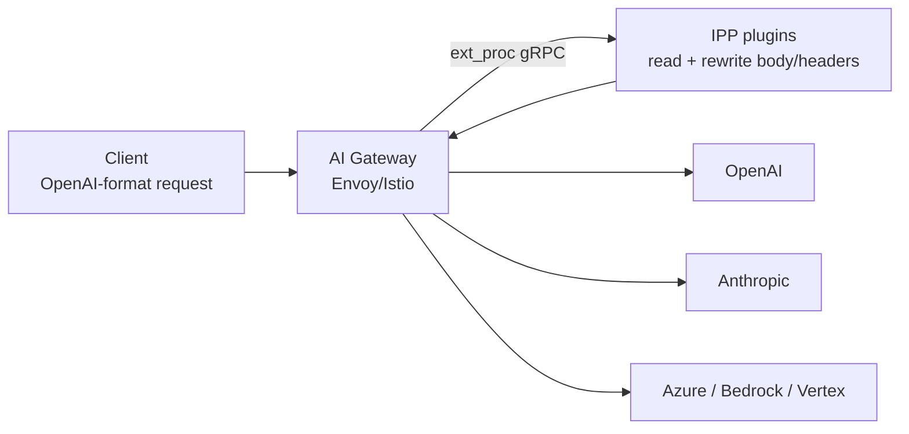
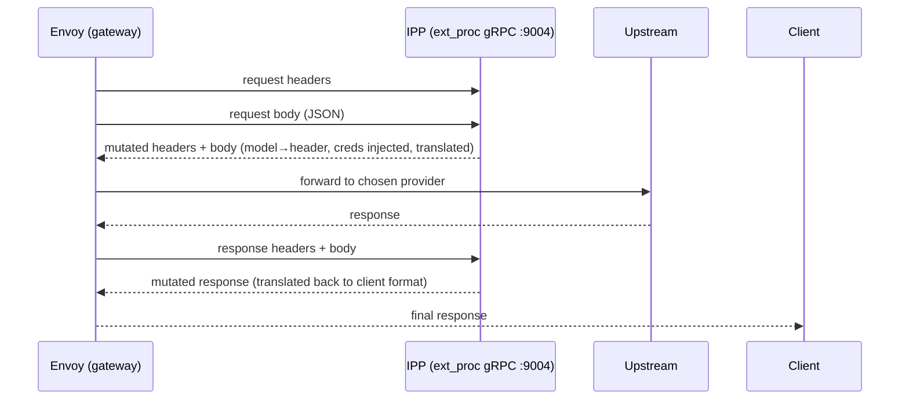
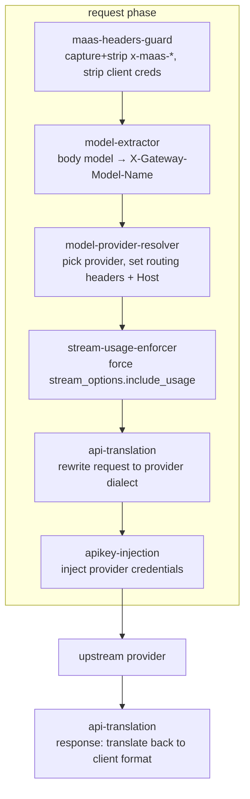
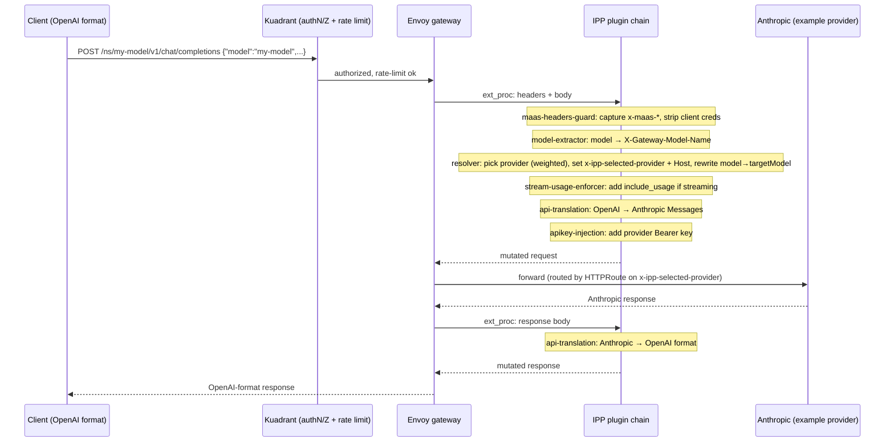

# AI Gateway Payload Processing (IPP) — A Complete Technical Guide

> A beginner-friendly, in-depth reference for **`opendatahub-io/ai-gateway-payload-processing`** — the **Inference Payload Processor (IPP)**: a set of Envoy `ext_proc` plugins that inspect and rewrite LLM requests/responses in flight, giving the MaaS AI Gateway model-based routing, multi-provider federation, credential injection, API translation, guardrails, and metering.
>
> Read top-to-bottom to learn it, or jump to any section. Each section ends with **✅ Check your understanding**, and there's a **Q&A / FAQ** at the end.

**Repo:** `opendatahub-io/ai-gateway-payload-processing` · **Go module:** `github.com/opendatahub-io/ai-gateway-payload-processing` · **Binary:** `bbr` · **Built on:** the llm-d pluggable IPP framework (`github.com/llm-d/llm-d-inference-payload-processor`), itself adapted from `kubernetes-sigs/gateway-api-inference-extension`'s Body-Based Routing (`cmd/bbr`).

---

## Table of contents

1. [Executive summary](#1-executive-summary)
2. [Foundations: Envoy, ext_proc & the gateway data plane](#2-foundations-envoy-ext_proc--the-gateway-data-plane)
3. [What IPP is and why it exists](#3-what-ipp-is-and-why-it-exists)
4. [Architecture: the plugin pipeline](#4-architecture-the-plugin-pipeline)
5. [CycleState — the inter-plugin blackboard](#5-cyclestate--the-inter-plugin-blackboard)
6. [Every plugin, in depth](#6-every-plugin-in-depth)
7. [The config API / CRDs](#7-the-config-api--crds)
8. [API translation deep dive](#8-api-translation-deep-dive)
9. [Controllers: creating the mesh objects](#9-controllers-creating-the-mesh-objects)
10. [A request's full journey](#10-a-requests-full-journey)
11. [Tech stack, build & FIPS](#11-tech-stack-build--fips)
12. [Deployment & MaaS integration](#12-deployment--maas-integration)
13. [Testing & CI](#13-testing--ci)
14. [Design patterns](#14-design-patterns)
15. [Advantages, limitations & gotchas](#15-advantages-limitations--gotchas)
16. [Glossary](#16-glossary)
17. [Q&A / FAQ](#17-qa--faq)
18. [References & further reading](#18-references--further-reading)

---

## 1. Executive summary

**One-liner:** *IPP is the "smart middle" of the AI gateway — a chain of plugins that reads each inference request's body, decides which model/provider it should go to, translates the request into that provider's API dialect, injects the right credentials, optionally enforces guardrails and token budgets, and mirrors the response back into the client's expected format — all without the client or the model knowing.*

Why it's needed: a gateway operating at the HTTP layer normally routes on **URL path and headers**. But an LLM request's most important routing key — *which model you want* — lives **inside the JSON body** (`{"model": "gpt-4o", ...}`). IPP solves this and much more:

- **Body-based routing** — promote the body's `model` field to a header so the gateway can route on it.
- **Multi-provider federation** — one OpenAI-compatible endpoint fans out to OpenAI, Anthropic, Azure, AWS Bedrock, Google Vertex — with weighted load-balancing.
- **API translation** — a client speaking OpenAI Chat Completions can talk to an Anthropic or Vertex backend; IPP rewrites the request and the response.
- **Credential injection** — the gateway holds provider API keys (or AWS SigV4 / GCP OAuth2), strips the client's own credentials, and injects the correct upstream auth.
- **Governance hooks** — NeMo guardrails (content safety) and external metering (token-budget enforcement, usage events).

The two ideas to hold onto:
1. **It's a plugin pipeline over Envoy `ext_proc`.** Envoy streams each request/response to IPP over gRPC; a configurable, ordered chain of plugins mutates it and hands it back.
2. **Everything is config- and CRD-driven.** Which plugins run (Helm `customConfig`), and which providers/models exist (`ExternalProvider` / `ExternalModel` CRDs), are all declarative — no code changes to add a provider.

---

## 2. Foundations: Envoy, ext_proc & the gateway data plane

*Skip if you already know Envoy ext_proc; otherwise this makes the rest readable.*

- **Envoy** is a high-performance proxy; it's the **data plane** under Istio and Gateway API — every request in/out of the mesh flows through an Envoy process.
- **ext_proc (External Processing)** is an Envoy filter that lets Envoy **stream a request/response to an external gRPC service** and apply the mutations that service returns. Envoy sends the request headers, then the body (buffered or streamed), then the response headers and body — and for each phase your service can add/remove headers, rewrite the body, or reject the request.
- **Why external?** It keeps custom logic *out* of Envoy (no recompiling, no WASM) — you run an ordinary Go service and Envoy calls it. IPP *is* that service.
- **`processing_mode` matters.** To rewrite a response body, ext_proc must be told to send it: `response_body_mode: FULL_DUPLEX_STREAMED` + `response_header_mode: SEND`. And streaming LLM responses need generous timeouts (`message_timeout` and `grpc_service.timeout = 300s`) or large-context/slow-first-token requests get cut off.
- **Where IPP plugs in for MaaS:** the Helm chart installs an Istio **`EnvoyFilter`** onto the gateway that wires ext_proc to the IPP service, inserted **`INSERT_AFTER`** the Kuadrant WasmPlugin anchor — so Kuadrant's auth/rate-limiting runs first, then IPP does payload processing.

### ✅ Check your understanding
- Why can't a plain HTTP gateway route on the model name by default?
- What does ext_proc let you do without modifying Envoy itself?
- Why must ext_proc timeouts be raised to ~300s for LLM traffic?

---

## 3. What IPP is and why it exists

IPP is a **collection of Envoy `ext_proc` plugins** for LLM gateways. The repo's own README frames it as *"Payload Processing plugins that will be connected to an AI Gateway via a pluggable IPP framework developed as part of llm-d,"* with the flagship capability being *"promoting the model from a field in the body to a header and routing to a selected endpoint accordingly."*

- The binary (`bbr`, from its Body-Based-Routing lineage) registers plugins with the upstream llm-d runner (`cmd/main.go`: `plugins.RegisterPlugins()` → `runner.NewRunner().WithExecutableName("ai-gateway-payload-processing")`), optionally starts three Kubernetes controllers, and serves ext_proc on port **9004** (health on **9005**).
- **Lineage:** it adapts `kubernetes-sigs/gateway-api-inference-extension`'s `cmd/bbr` (documented in the `cmd/main.go` header) and builds on the **llm-d pluggable payload-processor framework** for the plugin/profile machinery.
- **Relationship to MaaS:** IPP is the piece that turns the MaaS gateway from "route to internal models" into "route to *any* internal or external provider, with translation, credentials, guardrails, and metering." A `legacymigration` controller even consumes the old `maas.opendatahub.io ExternalModel` CRD and converts it to IPP's new CRDs.

### ✅ Check your understanding
- What's the difference between the binary name (`bbr`) and the product (IPP)?
- Name three responsibilities IPP adds on top of basic gateway routing.

---

## 4. Architecture: the plugin pipeline

IPP is driven by a **config** (supplied via Helm `customConfig`) that declares **plugins** grouped into **profiles**. Each profile has ordered phases:
- **`request`** — plugins that run on the way in (implement `RequestProcessor.ProcessRequest`).
- **`response`** — plugins that run on the buffered full response (`ResponseProcessor.ProcessResponse`).
- **`responseChunk`** — plugins that run on each streaming SSE chunk (`ResponseChunkProcessor.ProcessResponseChunk(..., isFinal)`).

A special plugin type, a **`ProfilePicker`** (`Pick(...)`), can choose *which profile* runs per request (e.g. translate vs passthrough).

**The default pipeline** (from `deploy/payload-processing/values.yaml`, profile `default`):

Each plugin is a small struct with:
- `TypedName() plugin.TypedName` — its declared type + instance name.
- a `Factory(name, json.RawMessage, plugin.Handle)` registered via `plugin.Register(Type, Factory)` in `pkg/plugins/plugins.go`.
- one or more phase methods (`ProcessRequest` / `ProcessResponse` / `ProcessResponseChunk` / `Pick`).

Two controller models coexist (important — see §9):
1. **In-plugin store reconcilers** — a plugin's factory starts controller-runtime watchers that fill a thread-safe in-memory store, read *synchronously* during request processing (e.g. `model-provider-resolver` watches CRDs; `apikey-injection` watches Secrets).
2. **Standalone controllers** (`pkg/controller/*`, wired in `cmd/controllers.go`) that create Kubernetes networking objects (HTTPRoute, Service, ServiceEntry, DestinationRule). These are skipped when `DISABLE_EXTERNAL_MODEL_CONTROLLER=true`.

### ✅ Check your understanding
- What are the three request/response phases a profile can define?
- What does a `ProfilePicker` decide?
- Name the two distinct "controller" models IPP runs and how they differ.

---

## 5. CycleState — the inter-plugin blackboard

Plugins are loosely coupled: they don't call each other. Instead they share a **`plugin.CycleState`** — a thread-safe key/value bus scoped to a *single request cycle*. One plugin writes (`cycleState.Write(key, val)`), a later one reads (`plugin.ReadCycleStateKey[T](cycleState, key)`).

Keys are centralized in `pkg/plugins/common/state/state-keys.go`:

| Key | Written by | Meaning |
|---|---|---|
| `model`, `provider`, `endpoint`, `path` | model-provider-resolver | chosen model/provider/backend + path override |
| `api-format`, `input-api-format` | resolver / translation | provider dialect and detected client dialect |
| `auth`, `credential-ref-name`, `credential-ref-namespace`, `model-config` | resolver | how/where to fetch upstream creds |
| `maas-headers` | maas-headers-guard | captured `x-maas-*` identity headers |
| `metering-username/-group/-subscription/-model/-request-time/-last-usage/-user-agent` | metering | identity + usage for billing events |

The request/response objects the plugins mutate are the framework's `InferenceRequest` / `InferenceResponse`, exposing `Headers map[string]string`, `Body map[string]any`, streaming `CurrentChunk`, and mutators `SetHeader` / `RemoveHeader` / `SetBody` / `SetBodyField`.

> **Mental model:** *CycleState is a scratchpad passed hand-to-hand down the pipeline. The resolver writes "provider=anthropic, endpoint=…, creds=secretX"; translation reads the format; apikey-injection reads the creds ref. No plugin needs a reference to any other.*

### ✅ Check your understanding
- How do plugins pass data to each other without direct references?
- Which plugin writes the credential reference that `apikey-injection` later reads?

---

## 6. Every plugin, in depth

`RegisterPlugins()` in `pkg/plugins/plugins.go` registers **10 plugin types** (registration order ≠ pipeline order). Six are in the default chain; the rest are opt-in.

### 6.1 `maas-headers-guard` — *default* — `pkg/plugins/maas-headers-guard/`
RequestProcessor. Captures every `x-maas-*` header (case-insensitive prefix), **strips them** from the outbound request, and stores the captured map in CycleState `maas-headers` (for the metering plugin's identity). Also **unconditionally strips** client credentials `authorization` and `x-api-key` so they never leak to the upstream model. *This is the security front door.*

### 6.2 `model-extractor` (`body-field-to-header`) — *default* — upstream framework
Maps body field `model` → header **`X-Gateway-Model-Name`**. This is the literal "body-based routing" primitive — it makes the model name visible to header-based routing (and to the resolver).

### 6.3 `model-provider-resolver` — *default* — `pkg/plugins/model-provider-resolver/`
The brain. RequestProcessor. Steps:
1. Read the model (prefers header `x-gateway-model-name`, else body `model`).
2. Detect the **client API format** from the `:path` suffix (`/v1/chat/completions`→`openai-chat`, `/v1/messages`→`messages`, `/v1/responses`→`openai-responses`) → writes `InputAPIFormatKey`.
3. Look up the model in the in-memory `infoStore`. Handles the **LLMISvc BBR publisher-ID** case (`publishers/{ns}/models/{name}` → rewrite body `model` to the bare name).
4. On match, `selectByWeight` picks one provider ref (**weighted random**; weight 0 disables a ref; all-zero → `BadRequest`).
5. Sets routing header **`x-ipp-selected-provider`** and `Host` = the provider endpoint; rewrites body `model` → the provider's `targetModel`.
6. Writes to CycleState: `provider`, `model`, `api-format`, `auth`, `endpoint`, `path`, `credential-ref-name/-namespace`, `model-config`.

Its factory registers **two cross-watched watchers** (ExternalProvider + ExternalModel) into `infoStore`.

### 6.4 `stream-usage-enforcer` — *default* — `pkg/plugins/stream-usage-enforcer/`
RequestProcessor. If the request is streaming (`stream==true`) and OpenAI-chat format, injects `stream_options.include_usage=true` so streaming responses include token usage (needed for metering). Skips non-OpenAI formats.

### 6.5 `api-translation` — *default (request+response)* — `pkg/plugins/api-translation/`
Translates between client and provider API dialects (deep dive in §8). Request phase rewrites the body + `:path` + headers into the provider's format; response phase mirrors the provider's response back into the client's format. Uses an `isPassthrough` heuristic to skip translation when client and provider formats already match (except `openai-chat`, which always runs the translator because it must rewrite `:path`).

### 6.6 `apikey-injection` — *default* — `pkg/plugins/apikey-injection/`
RequestProcessor. Reads `auth` type from CycleState:
- empty → internal model, no-op.
- `none` → strip `authorization` only (mTLS hub-to-spoke).
- otherwise fetch creds from `secretStore` (by `credential-ref-name/-namespace`) and dispatch to an `AuthHeadersGenerator`:
  - `apikey` → `NewAPIKeyAuthGenerator()` — header/prefix from model config (default `Authorization: Bearer `), needs creds field `api-key`.
  - `sigv4` → `NewSigV4AuthGenerator()` — AWS SigV4 via `aws-sdk-go-v2`; fields `aws-access-key-id/-secret-access-key/-session-token`; emits `Authorization`, `X-Amz-Date`, `X-Amz-Content-Sha256`, `X-Amz-Security-Token`.
  - `oauth2` → `NewGCPOAuth2Generator()` — GCP OAuth2 from `gcp-service-account-json`; mints & caches a Bearer token (scope `cloud-platform`, cache keyed by SHA-256 of the SA JSON, 5-min expiry margin, 10s fetch timeout).

**Defense-in-depth:** its factory builds a **label-filtered informer** (`newFilteredSecretCache`) so only Secrets labeled `inference.llm-d.ai/ipp-managed: "true"` are watched/cached — even though the ClusterRole grants broader Secret access. The reconciler requires the same label.

### 6.7 `external-metering` / `external-metering-streaming` — *opt-in (Dev Preview)* — `pkg/plugins/external-metering/`
Two types: buffered (`external-metering`, RequestProcessor + ResponseProcessor) and streaming (`external-metering-streaming`, RequestProcessor + ResponseChunkProcessor). Config `externalMeteringConfig`: `meteringURL` (required), `timeoutSeconds` (5), `featureKey` (`inference-tokens`), `source` (`maas-gateway`), `failOpen` (default true).
- **Request:** reads identity from CycleState `maas-headers`, then `checkBalance` → fail-open allows on error; fail-closed returns `ServiceUnavailable`; `!HasAccess` returns `ResourceExhausted "token budget exhausted"`.
- **Response:** reports **CloudEvents 1.0** (`type: inference.tokens.used`) with prompt/completion/total/cached/reasoning tokens + `duration_ms` + user agent. Streaming path buffers SSE chunks across Envoy chunk boundaries to recover usage; on final, reports usage or an `inference.request.error` event.
- HTTP contract (OpenMeter-compatible): `GET {base}/api/v1/customers/{id}/entitlements/{key}/value?model=`, `POST {base}/api/v1/events`.

### 6.8 `nemo-request-guard` / `nemo-response-guard` — *opt-in* — `pkg/plugins/nemo/`
NVIDIA **NeMo guardrails** (content safety). POSTs to NeMo `/v1/guardrail/checks` (config `NemoURL`, `TimeoutSeconds` default 360). NeMo always returns HTTP 200; the decision is in the body `status`: `passed`/`modified` → proceed, `blocked` → `Forbidden (403)`, unknown/unreachable → **fail-closed** `Internal (500)`. Request guard extracts OpenAI messages or MCP JSON-RPC `params.arguments` (input rails); response guard extracts assistant content from `choices` or MCP `result.content` (output rails — **OpenAI-format only**).

### 6.9 `passthrough-profile-picker` — *opt-in* — `pkg/plugins/passthrough-profile-picker/`
A `ProfilePicker`. Config `translationProfile` (default `translation`), `passthroughProfile` (default `passthrough`). `Pick` reads the input/output formats and calls `isPassthrough`: no input format → translation; no output format (internal model) → passthrough; formats differ → translation; `openai-chat` → translation (needs `:path` rewrite); else passthrough. Requires `model-provider-resolver` to run in **preProcessing** before `Pick`.

### ✅ Check your understanding
- Which plugin strips the client's `authorization` header, and why is that the first plugin?
- Trace how the model name gets from the JSON body to a routing decision (which two plugins, in order).
- What's the difference between `fail-open` (metering) and `fail-closed` (NeMo), and when is each appropriate?
- Which two auth mechanisms besides a plain API key can `apikey-injection` generate?

---

## 7. The config API / CRDs

API group **`inference.opendatahub.io/v1alpha1`** (`api/inference/v1alpha1/`) — distinct from the legacy `maas.opendatahub.io`. Two CRDs model "an external LLM provider" and "a model served by it."

### 7.1 `ExternalProvider`
Represents *a provider account/endpoint*.
- `spec.provider` — freeform string (drives auth-header defaults; e.g. `openai`, `anthropic`, `azure`, `vertex`, `bedrock`).
- `spec.endpoint` — FQDN (no scheme/path).
- `spec.auth` (`AuthConfig`, required) — `type` enum **`apikey | sigv4 | oauth2`** + `secretRef`.
- `spec.config` — freeform map (e.g. Vertex `{project, location}`).
- `status.phase` (`Pending | Ready | Failed`) + conditions.

### 7.2 `ExternalModel`
Represents *a client-facing model* backed by one or more provider bindings.
- `spec.modelName` — client-facing name (defaults to `metadata.name`).
- `spec.externalProviderRefs[]` (1–64) — each binding has:
  - `ref` (provider, same namespace), `targetModel` (the provider's real model id),
  - `apiFormat` (**only `openai-chat`, `messages`, `vertex-messages` are wired in translators**),
  - `path` (pattern `^/.*`, supports `{key}` placeholders; reserved `{model}`),
  - `config` / `auth` overrides,
  - `weight` (`0–100`, default 1; **0 disables** this binding).
- `status.phase`, `status.httpRouteName`, conditions.

### 7.3 Supporting types & enums
- `AuthConfig.Type`: `apikey | sigv4 | oauth2`. (Runtime also has `none` for mTLS routing — **not** in the CRD enum.)
- `apiformat`: `openai-chat`, `messages`, `openai-responses`, `vertex-messages`.
- `provider`: `openai`, `anthropic`, `azure`, `vertex`, `bedrock` (+ legacy `*-openai` variants).
- **Path placeholders** (`pkg/controller/common/path.go`): `ResolvePath` substitutes `{key}` from merged config; `{model}` → `targetModel`; errors on any unresolved placeholder.

**Weighted multi-provider example** — 80% OpenAI, 20% Azure — is just two `externalProviderRefs` with `weight: 80` and `weight: 20`. Credential rotation is a Secret update, picked up by the informer within seconds.

### ✅ Check your understanding
- What does an `ExternalProvider` model vs an `ExternalModel`?
- How would you send 20% of a model's traffic to a second provider?
- Which `apiFormat` values actually have translators wired?

---

## 8. API translation deep dive

`api-translation` holds a `map[translatorKey]Translator` keyed by `(inputFormat, outputFormat)`:

| Input → Output | Translator |
|---|---|
| `openai-chat → openai-chat` | `openai.NewOpenAITranslator()` — pass-through, only rewrites `:path` to `/v1/chat/completions` |
| `openai-chat → messages` | `anthropic.NewAnthropicTranslator()` — full OpenAI ↔ Anthropic Messages |
| `openai-chat → vertex-messages` | `vertex.NewVertexAnthropicTranslator()` |
| `messages → vertex-messages` | `vertex.NewVertexAnthropicPassthroughTranslator()` (native Anthropic clients) |

- **Anthropic translator** does the heavy lifting: system-prompt separation, `tool_calls` ↔ `tool_use`, `tool_result`, images via data URL, `stop_reason` ↔ `finish_reason`, usage mapping; sets `anthropic-version: 2023-06-01`, path `/v1/messages`, default `max_tokens` 4096.
- **Vertex translators** delegate the body to the Anthropic translator, then strip/adjust Vertex-specific bits (remove `model`, inject `anthropic_version` from config `anthropicVersion`, strip `anthropic-beta` and body fields like `context_management/betas/mcp_servers/service_tier/container/stream_options`). The passthrough variant does no body conversion (native Anthropic clients) but applies the same Vertex adjustments.
- **`isPassthrough`** = both formats set, equal, and *not* `openai-chat`. When passthrough: skip translation, remove `authorization`, apply the `:path` override from `PathKey`.
- **`ConfigAwareTranslator.TranslateRequestWithConfig`** lets Vertex read `ModelConfigKey` (project/location/version).
- `response_field_stripper.go` removes provider-specific dot-path fields (supports `[]`) from responses.

> **The payoff:** a client library that only speaks OpenAI Chat Completions can transparently use Claude on Anthropic *or* Claude on Vertex — IPP rewrites the request going out and the response coming back.

### ✅ Check your understanding
- Why does `openai-chat → openai-chat` still run a translator instead of passing through?
- What does the Vertex translator reuse from the Anthropic translator, and what does it change?

---

## 9. Controllers: creating the mesh objects

Beyond the request-time stores, three standalone controllers (`pkg/controller/*`, wired in `cmd/controllers.go`, disabled by `DISABLE_EXTERNAL_MODEL_CONTROLLER=true`) reconcile CRDs into Istio/Gateway-API objects:

- **`externalprovider`** — validates the `secretRef`, then creates an **ExternalName Service** (port 443), a **ServiceEntry** (`MESH_EXTERNAL`, DNS, HTTPS 443), and a **DestinationRule** (TLS `SIMPLE` origination) — i.e. it teaches the mesh how to reach the external provider over TLS.
- **`externalmodel`** — creates an **HTTPRoute** per model. Rules match path prefix `/{namespace}/{modelName}` + header `x-ipp-selected-provider` (one rule per provider ref), plus `X-Gateway-Model-Name` rules and a fallback to `refs[0]`; each rule sets `Host` = provider endpoint + a request timeout. ParentRef = the gateway (`GATEWAY_NAME`/`GATEWAY_NAMESPACE`, defaults `maas-default-gateway` / `openshift-ingress`).
- **`legacymigration`** — watches the legacy `maas.opendatahub.io/v1alpha1 ExternalModel` (as unstructured) and creates new `ExternalProvider` + `ExternalModel` (auth `apikey`), mapping provider→apiFormat (anthropic→`messages`, else `openai-chat`) and →default path. Skipped if the legacy CRD isn't installed.

Constants (`pkg/controller/common/constants.go`): `DefaultTLSPort=443`, `DefaultGatewayName="maas-default-gateway"`, `DefaultGatewayNamespace="openshift-ingress"`, `DefaultRouteTimeout="300s"`.

> **The two halves fit together:** the `externalmodel` controller writes an HTTPRoute that routes on the header `x-ipp-selected-provider`; the `model-provider-resolver` *plugin* sets exactly that header at request time. Control plane (controllers) and data plane (plugins) meet at that header.

### ✅ Check your understanding
- Which header connects the resolver plugin to the HTTPRoute the controller creates?
- What three mesh objects does the `externalprovider` controller create, and what is each for?

---

## 10. A request's full journey

### ✅ Check your understanding
- At which step is the client's own API key removed, and at which step is the provider's key added?
- How does Envoy know to send the request to Anthropic specifically?

---

## 11. Tech stack, build & FIPS

- **Go 1.25.0**; module `github.com/opendatahub-io/ai-gateway-payload-processing`.
- **Key deps:** `llm-d/llm-d-inference-payload-processor` (the framework), `aws-sdk-go-v2` (SigV4), `controller-runtime` v0.23.3, `sigs.k8s.io/gateway-api` v1.5.1, `k8s.io` v0.35.6, `envoyproxy/go-control-plane/envoy` v1.37.0, `golang.org/x/oauth2` + `cloud.google.com/go/compute/metadata` (GCP OAuth2), `hashicorp/golang-lru`, `caio/go-tdigest`. Tests: ginkgo/gomega, testify.
- **Makefile:** `generate` (controller-gen object), `manifests` (crd), `verify-codegen` (git-diff on `api/` + `config/crd/`), `fmt`/`vet`/`lint` (golangci-lint v2.9.0)/`tidy`, `test-unit` (envtest, `-race`, K8s 1.31.0), `test-e2e*`, `image-*`.
- **FIPS:** `GO_STRICTFIPS` toggles `GOEXPERIMENT=strictfipsruntime`; images **always** build FIPS (`CGO_ENABLED=1 GOEXPERIMENT=strictfipsruntime`, `-trimpath`, ldflags inject `CommitSHA`/`BuildRef`). Builder `ubi9/go-toolset:1.25`, runtime `ubi9/ubi-minimal` (pinned digest), `USER 1001`, `ENTRYPOINT ["/bbr"]`.
- **Registries:** prod `quay.io/opendatahub/odh-ai-gateway-payload-processing`; e2e `quay.io/opendatahub/ai-gateway-payload-processing-e2e`.

### ✅ Check your understanding
- What does `GOEXPERIMENT=strictfipsruntime` enable, and when is it forced on?

---

## 12. Deployment & MaaS integration

- **Helm chart** `deploy/payload-processing/` (v0.1.0, appVersion 0.2.0) **wraps the upstream chart** `payload-processor` (`oci://ghcr.io/llm-d/charts` v0.1.0, aliased `upstreamIpp`). Sets image, ports 9004/9005, `multiNamespace: true`, and the `customConfig` plugin chain/profiles.
- **RBAC** (`templates/rbac.yaml`): ClusterRole (multiNamespace) or namespaced Role granting Secrets get/list/watch, `inference.opendatahub.io` CRDs CRUD + status/finalizers, services/httproutes/serviceentries/destinationrules CRUD, and legacy `maas.opendatahub.io/externalmodels` read.
- **EnvoyFilter/ext_proc** is created by the *upstream* chart (`provider.name: istio`); the overlay passes `envoyFilter.operation` (**`INSERT_AFTER`** the Kuadrant anchor in prod; `INSERT_FIRST` in e2e). The chart must be installed **in the Gateway's namespace**; `GATEWAY_NAME`/`GATEWAY_NAMESPACE` env drive the controllers' HTTPRoute parentRef.
- **Sample manifests** (`deploy/samples/manifests/`): `openai.yaml`, `anthropic.yaml`, `vertex-openai.yaml`, `multi-provider-weights.yaml` — all `inference.opendatahub.io/v1alpha1`, Secrets labeled `inference.llm-d.ai/ipp-managed: "true"` with `stringData.api-key`.
- **MaaS integration:** the `legacymigration` controller consumes `maas.opendatahub.io ExternalModel`; MaaS governance still needs a `MaaSModelRef` (see `docs/testing-with-simulator.md`). IPP's controllers create the mesh objects that route MaaS gateway traffic to external providers.
- **Per-provider docs** (`docs/providers/*`): OpenAI (Bearer), Anthropic (`x-api-key`), Azure (`api-key`), Bedrock (Mantle Bearer key at `bedrock-mantle.{region}.api.aws`), Vertex (OAuth2).

> **Coupling caution (per AGENTS.md):** this repo is tightly coupled upstream — the `payload-processor` chart, the llm-d framework version, and RBAC changes must be mirrored into parent operator repos.

### ✅ Check your understanding
- Why must the chart be installed in the *gateway's* namespace?
- What label must a provider-credential Secret carry to be usable, and why?

---

## 13. Testing & CI

- **Unit tests** (`make test-unit`): `go test ./pkg/... -race` against **envtest** (K8s 1.31.0); CRDs fetched by `hack/download-test-crds.sh` (Istio + Gateway API + legacy MaaS). Table-driven translator/auth/nemo tests.
- **E2E** (`test/e2e/`, ginkgo/gomega): providers `e2e-openai`, `e2e-anthropic`, `e2e-azure`, `e2e-bedrock`, `e2e-vertex-openai`. Tiers: **tier1/smoke** (HTTP 200 + valid OpenAI response), **tier2** key-validation (wrong key → 401), plus tool-calling, multimodal, json-mode, conversation. Requests go via an in-cluster `curl` pod to `http://<gw-svc>.<ns>.svc:80/<ns>/<model>/v1/chat/completions`.
- **E2E cluster** (`test/e2e/scripts/setup-kind.sh`): Kind + Gateway API CRDs v1.4.0 + Istio 1.29.2 (`ENABLE_GATEWAY_API_INFERENCE_EXTENSION=true`) + Gateway + `helm install` with `e2e-values.yaml`. Model backend = **`llm-katan`** simulator (echo/transformers/vllm backends; per-provider default keys; `/`, `/health`, `/metrics`).
- **GitHub workflows:** `ci-pr-checks.yaml` (`make verify` + `make test`), `ci-e2e.yaml` (simulator gate → setup → junit), `ci-release.yaml` (multi-arch buildx amd64/arm64 → ghcr → Trivy HIGH/CRITICAL exit-1), typos, PR-size, promote-to-stable.
- **Tekton/Konflux** (`.tekton/`): six build PipelineRuns (prod + e2e; `:odh-pr` / `:latest` / `:odh-stable`) resolving `pipeline/multi-arch-container-build.yaml` from `odh-konflux-central` (x86_64/arm64/ppc64le/s390x), plus `ai-gateway-group-test.yaml` (integration test on `/group-test`, 4h timeout, tying prod + e2e images together). *See the companion [odh-konflux-central guide](../odh-konflux-central/) for how that group test runs.*

> **Testing terms** (unit / integration / smoke / e2e) are covered in depth in the [odh-konflux-central guide §3](../odh-konflux-central/#3-software-testing--a-complete-primer).

### ✅ Check your understanding
- What stands in for a real LLM in E2E, and why is that useful?
- Where does the Konflux group test for this repo actually run (which repo defines it)?

---

## 14. Design patterns

- **Plugin registry + factory + typed-name** — `plugin.Register(Type, Factory)`; each plugin a small struct.
- **Config-driven pipeline + ProfilePicker** — profiles/plugins declared in Helm `customConfig`; a picker selects a profile per request.
- **CycleState as a typed blackboard** — `ReadCycleStateKey[T]` / `Write`, keys centralized; loose coupling.
- **Two-tier controllers** — in-plugin store reconcilers (request-time reads) vs standalone object-creating controllers.
- **Defense-in-depth RBAC** — broad Secret ClusterRole but a label-filtered informer restricts what's cached.
- **Fail-open vs fail-closed as config** — metering `failOpen` default true; NeMo fail-closed.
- **Passthrough vs translate** — `isPassthrough` avoids unnecessary body mutation while still rewriting `:path`.
- **Streaming reassembly** — metering buffers SSE across Envoy chunk boundaries to recover usage.
- **Upstream-lineage adaptation** — documents its provenance from gateway-api-inference-extension / llm-d.

### ✅ Check your understanding
- How does the label-filtered informer improve security beyond the ClusterRole?

---

## 15. Advantages, limitations & gotchas

### Advantages
- **Add capabilities without touching the gateway** — config-driven, ordered, profiled plugins.
- **One OpenAI-compatible entrypoint → many providers**, with weighted routing and hot credential rotation (Secret update picked up in seconds).
- **Strong security posture** — strips client creds, label-filtered Secret cache, FIPS builds, mesh TLS origination.
- **Extensible auth** (apikey/sigv4/oauth2) and **translation** (openai/anthropic/vertex) via interfaces.

### Limitations / gotchas (grounded in code)
- **Only three translations wired** — `openai-chat`, `messages`, `vertex-messages`. `openai-responses` (`/v1/responses`) is *detected* but has **no translator** (unsupported).
- **NeMo response guard is OpenAI-format only** — passthrough Anthropic responses are silently skipped.
- **No in-repo metrics** — `pkg/metrics/README.md` is a placeholder; the only observability path is the opt-in external-metering plugin.
- **ext_proc config is load-bearing** — you must set 300s timeouts and the right `processing_mode`, or streaming/large-context requests fail.
- **Chunk-boundary buffering is fragile** — metering has to reassemble SSE across Envoy chunk boundaries to recover usage.
- **Tight upstream coupling** — the `payload-processor` chart, the llm-d framework version, and RBAC must be mirrored to parent operator repos.
- **E2E depends on an external shared simulator IP** — E2E can silently skip in CI if it's unreachable.
- **Enum/runtime divergence** — `auth.None` is a valid runtime type (mTLS) but not in the CRD enum; `oauth2` is marked "not used yet" in `auth.go` though the GCP generator implements it.

### ✅ Check your understanding
- Name two request formats or providers that are *partially* supported and how.
- Why is "no in-repo metrics" a notable limitation for a gateway component?

---

## 16. Glossary

- **Envoy** — the proxy/data-plane under Istio & Gateway API.
- **ext_proc** — Envoy external-processing filter; streams requests/responses to an external gRPC service for mutation.
- **IPP (Inference Payload Processor)** — this product; the `bbr` binary implementing ext_proc plugins.
- **BBR (Body-Based Routing)** — routing on a field inside the request body (the `model`); IPP's origin.
- **Plugin / profile / phase** — a mutation unit / a named ordered set / request|response|responseChunk.
- **CycleState** — thread-safe per-request key/value bus shared between plugins.
- **ProfilePicker** — plugin that selects which profile runs for a request.
- **ExternalProvider / ExternalModel** — CRDs (`inference.opendatahub.io/v1alpha1`) modeling a provider account and a client-facing model.
- **Passthrough vs translate** — forward as-is vs rewrite between API dialects.
- **SigV4 / OAuth2** — AWS request signing / GCP token auth, both generated by `apikey-injection`.
- **EnvoyFilter / ServiceEntry / DestinationRule / HTTPRoute** — Istio/Gateway-API objects IPP wires or creates.
- **NeMo guardrails** — NVIDIA content-safety checks (input/output rails).
- **Metering / CloudEvents** — token-usage accounting; usage reported as CloudEvents 1.0 to an OpenMeter-compatible endpoint.
- **FIPS / strictfipsruntime** — federal crypto compliance mode Go builds are compiled with.
- **llm-katan** — the lightweight LLM simulator used in E2E.

---

## 17. Q&A / FAQ

**Q: In one sentence, what is IPP?**
A: A chain of Envoy ext_proc plugins that reads each LLM request's body to route it to the right provider, translates the request/response between API dialects, injects provider credentials, and optionally enforces guardrails and token budgets.

**Q: Why is it called `bbr`?**
A: It descends from Kubernetes SIG's Body-Based Routing (`cmd/bbr`) example; the product name is IPP.

**Q: How does it route on the model when the model is inside the JSON body?**
A: `model-extractor` copies body `model` → header `X-Gateway-Model-Name`; `model-provider-resolver` then picks a provider and sets `x-ipp-selected-provider` + `Host`; an HTTPRoute (created by the `externalmodel` controller) routes on that header.

**Q: Can an OpenAI client talk to Claude?**
A: Yes — `api-translation` rewrites the OpenAI Chat Completions request into Anthropic Messages (or Vertex) on the way out, and rewrites the response back on the way in.

**Q: Where do provider API keys live, and how are client keys handled?**
A: Provider keys live in labeled Kubernetes Secrets (`inference.llm-d.ai/ipp-managed: "true"`). `maas-headers-guard` strips the client's `authorization`/`x-api-key`; `apikey-injection` adds the correct upstream credential (API key, SigV4, or GCP OAuth2).

**Q: How does weighted multi-provider routing work?**
A: An `ExternalModel` lists multiple `externalProviderRefs` with `weight`s; `selectByWeight` picks one per request by weighted random (weight 0 disables a binding).

**Q: What's the difference between the in-plugin stores and the standalone controllers?**
A: In-plugin stores are watchers that fill in-memory caches read *synchronously at request time*; standalone controllers reconcile CRDs into Istio/Gateway-API objects. The latter are disabled by `DISABLE_EXTERNAL_MODEL_CONTROLLER=true`.

**Q: What happens if the metering service or NeMo is down?**
A: Metering defaults to **fail-open** (allow the request); NeMo is **fail-closed** (block on unknown/unreachable). Both are deliberate policy choices.

**Q: How does it integrate with MaaS?**
A: A `legacymigration` controller converts legacy `maas.opendatahub.io ExternalModel` CRs into IPP's new CRDs, and IPP creates the mesh routing objects for the MaaS gateway. MaaS governance still requires a `MaaSModelRef`.

**Q: What's tested, and how?**
A: Unit tests via envtest; E2E on Kind + Istio with the `llm-katan` simulator across five provider configs (smoke, key-validation, tool-calling, multimodal, json-mode, conversation). The Konflux group test ties the prod + e2e images together.

---

## 18. References & further reading

### This repo
- **ai-gateway-payload-processing** — <https://github.com/opendatahub-io/ai-gateway-payload-processing>
- Key code: `cmd/{main,controllers}.go`, `pkg/plugins/plugins.go`, `pkg/plugins/*/`, `api/inference/v1alpha1/`, `pkg/controller/*`, `deploy/payload-processing/`.
- In-repo docs: `docs/external-provider-model.md`, `docs/multi-provider.md`, `docs/design-multi-provider-passthrough.md`, `docs/vertex-ai-setup.md`, `docs/testing-with-simulator.md`, `docs/providers/*`.

### Upstream & ecosystem
- **llm-d payload-processor framework** — <https://github.com/llm-d/llm-d-inference-payload-processor>
- **Gateway API Inference Extension (BBR origin)** — <https://github.com/kubernetes-sigs/gateway-api-inference-extension>
- **Envoy ext_proc** — <https://www.envoyproxy.io/docs/envoy/latest/configuration/http/http_filters/ext_proc_filter>
- **Istio EnvoyFilter** — <https://istio.io/latest/docs/reference/config/networking/envoy-filter/>
- **Gateway API** — <https://gateway-api.sigs.k8s.io/>
- **NeMo Guardrails** — <https://github.com/NVIDIA/NeMo-Guardrails>
- **CloudEvents** — <https://cloudevents.io/> · **OpenMeter** — <https://openmeter.io/>

### Related guides in this series
- **Models as a Service** — the platform IPP plugs into — <../models-as-a-service/>
- **odh-konflux-central** — how this repo's CI/integration tests run + a testing primer — <../odh-konflux-central/>

---

*This is a living reference — update sections as the platform evolves.*
