# Models as a Service (MaaS) — A Complete Technical Guide

> An in-depth, beginner-friendly reference for the **OpenDataHub / OpenShift AI "Models as a Service"** platform.
> It starts from fundamentals (what "inference" and "model serving" even mean) and builds up to the full architecture, APIs, and design patterns.
> Read top-to-bottom to learn it, or jump to any section as a lookup. Each section ends with **✅ Check your understanding** prompts, and there's a **Q&A / FAQ** at the end.

**Project:** `opendatahub-io/models-as-a-service` · **API group:** `maas.opendatahub.io/v1alpha1` · **License:** Apache 2.0

---

## Table of contents

1. [Executive summary](#1-executive-summary)
2. [The problem & the value it delivers](#2-the-problem--the-value-it-delivers)
3. [Who uses it — customers & personas](#3-who-uses-it--customers--personas)
4. [Foundations: inference, model serving & the engines](#4-foundations-inference-model-serving--the-engines)
5. [Dependencies & ecosystem primer](#5-dependencies--ecosystem-primer)
6. [Tech stack at a glance](#6-tech-stack-at-a-glance)
7. [High-level architecture](#7-high-level-architecture)
8. [The data model — CRDs explained](#8-the-data-model--crds-explained)
9. [Component deep-dive: maas-controller](#9-component-deep-dive-maas-controller)
10. [Component deep-dive: maas-api](#10-component-deep-dive-maas-api)
11. [The gateway / policy layer](#11-the-gateway--policy-layer)
12. [Model serving inside MaaS (vLLM, KServe, llm-d, external models)](#12-model-serving-inside-maas)
13. [Key workflows](#13-key-workflows)
14. [API reference](#14-api-reference)
15. [Design patterns catalogue](#15-design-patterns-catalogue)
16. [Deployment, packaging & ecosystem integration](#16-deployment-packaging--ecosystem-integration)
17. [Testing & CI](#17-testing--ci)
18. [Advanced topics](#18-advanced-topics)
19. [Advantages, disadvantages & trade-offs](#19-advantages-disadvantages--trade-offs)
20. [Challenges tackled during development](#20-challenges-tackled-during-development)
21. [Glossary](#21-glossary)
22. [Q&A / FAQ](#22-qa--faq)
23. [References & further reading](#23-references--further-reading)

---

## 1. Executive summary

**One-liner:** *MaaS is a Kubernetes-native control plane that turns raw LLM inference endpoints on OpenShift into a governed, multi-tenant, self-service product — adding identity-bound API keys, group-based access control, per-subscription token rate limiting, credential protection, and usage metering — without each model team building its own gateway.*

**In a paragraph:** Models as a Service sits *in front of* models served on OpenShift (via **KServe**, running **vLLM**) or hosted by external providers (OpenAI, Anthropic, Azure, Vertex, Bedrock). It is delivered as a sub-component of the **OpenDataHub (ODH) / Red Hat OpenShift AI (RHOAI)** platform. It builds on the **Gateway API** and the **Kuadrant** policy engine (**Authorino** for authentication/authorization, **Limitador** for rate limiting), and exposes an **OpenAI-compatible** endpoint so existing SDK clients work by just changing the `base_url`. Two Go components do the work: a **`maas-controller`** (a kubebuilder / controller-runtime operator) that reconciles custom resources into Gateway/Kuadrant policy, and a **`maas-api`** HTTP service that mints and validates API keys, resolves subscriptions, and serves a per-user model catalog. API-key *hashes* (never plaintext) live in PostgreSQL.

**The one mental model to keep — a "dual-gate":**

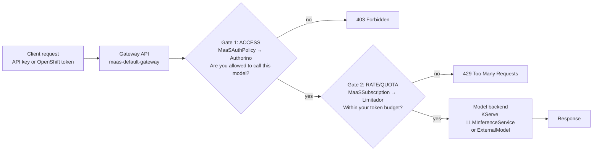

The core design decision: **access (who can call) and quota (how much) are separate CRDs** — `MaaSAuthPolicy` and `MaaSSubscription`. This lets one subscription tier be reused across teams while each team gets a different subset of models.

---

## 2. The problem & the value it delivers

### The problem
A raw model-serving endpoint (a KServe `LLMInferenceService`, a vLLM pod) has **no built-in notion of**:
- *Who* is allowed to call it.
- *How much* any caller may consume (token budgets / rate limits).
- *How to track* usage for billing, capacity planning, or SLA.
- *How to protect* the caller's credential from a malicious or compromised model backend.

Without a platform layer, **every model team re-implements its own gateway, auth, keys, and metering** — inconsistently and often insecurely.

### The value MaaS delivers

| Value | How | Who benefits |
|---|---|---|
| **Self-service consumption** | Developers mint their own `sk-oai-*` keys and hit an OpenAI-compatible endpoint — no ticket per request | App developers |
| **Governance / access control** | Admins declaratively map groups → models via `MaaSAuthPolicy`, *separate* from quota | Platform admins, security |
| **Cost control & rate limiting** | Per-subscription **token** rate limits enforced by Limitador; billing metadata (`organizationId`, `costCenter`, `billingRate`) | FinOps, platform owners |
| **Credential security** | Authorino **strips/replaces the caller's `Authorization` header** before forwarding to model backends — prevents token exfiltration; can inject per-model credentials from Secrets | Security teams |
| **Multi-tenancy** | Isolated tenants: namespaces, gateways, maas-api instances, per-tenant OIDC | Enterprises, service providers |
| **Observability** | Token/request/latency metrics → Prometheus + Grafana/Perses + Loki dashboards | SRE, capacity planning |
| **OpenAI API compatibility** | Drop-in `base_url` for existing OpenAI SDKs | Everyone — no client rewrite |

> **The credential-stripping story** (see §11, §18, §20): MaaS *requires* Kuadrant 1.4.2+ / Authorino v0.23.1+ specifically because that version added `Authorization`-header stripping. When you send your OpenShift token or API key, Authorino validates it but **must not forward it** to the (possibly untrusted) model — otherwise a compromised model could capture and replay your token.

### ✅ Check your understanding
- Why separate access from quota into two CRDs instead of one? *(Reuse, cardinality, separation of concerns.)*
- What concrete attack does credential stripping prevent?
- Name three user-facing values and the mechanism behind each.

---

## 3. Who uses it — customers & personas

MaaS models its personas on the **Gateway API persona split** (infra provider / cluster operator / app developer).

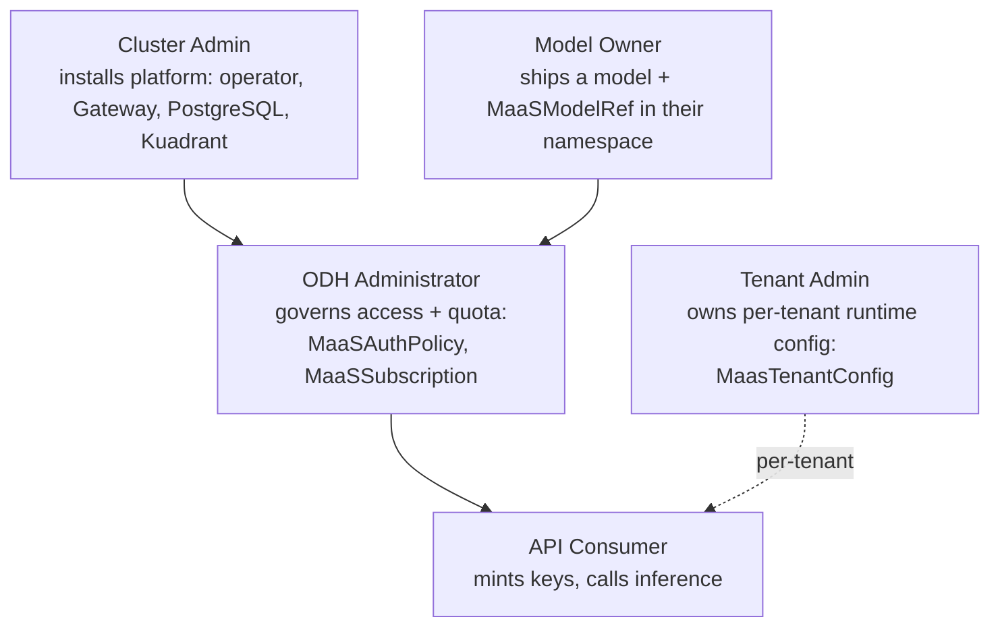

| Persona | Who they are | What they own |
|---|---|---|
| **Cluster admin** | OpenShift/platform admin | Operator install, Gateway, PostgreSQL, prerequisites |
| **Model owner** | ML team shipping a model | `MaaSModelRef` + the model workload (`LLMInferenceService` / `ExternalModel`) |
| **ODH administrator** | Governs access & quota | `MaaSAuthPolicy`, `MaaSSubscription`, Gateway/HTTPRoute surface |
| **API consumer** | App dev / automation | Self-service API keys; inference bounded by their subscription |
| **Tenant admin** | Owns per-tenant config | `MaasTenantConfig` (key policy, telemetry) |

**Target customers:** multi-team **RHOAI / ODH enterprise platforms** that want to expose shared, governed model access with tiered entitlements (e.g. *free* vs *premium*). Think regulated enterprises, internal AI platform teams, and organizations that need per-team cost attribution and audit.

> **Recommendation baked into the docs:** prefer **groups** over individual users in `subjects`/`owner` — many distinct users blow up policy and rate-limit cardinality; individual users are meant for service accounts.

### ✅ Check your understanding
- Which persona owns `MaaSSubscription` vs `MaaSModelRef`, and why the split?
- Why "prefer groups over individual users"?

---

## 4. Foundations: inference, model serving & the engines

*If the words "inference", "vLLM", "llm-d", and "model serving" blur together — this section is for you. Read it once and the rest of the guide clicks into place.*

### 4.1 What is "inference"?
Training a model = teaching it (expensive, done once). **Inference** = *using* the trained model to produce an output from an input (cheap-per-call, done constantly). For an LLM, inference is: **prompt in → generated text out**, produced one **token** at a time.

- A **token** is a chunk of text (~¾ of a word). "Hello world" ≈ 2–3 tokens.
- LLM cost and latency scale with **tokens**, not with the number of requests. That's *why* MaaS rate-limits by tokens (`usage.total_tokens`), not by request count.

### 4.2 What is "model serving"?
Model serving = **hosting a model behind a network API** so clients can send requests and get responses. A serving stack handles: loading model weights onto GPU/CPU, **batching** many requests together for throughput, streaming partial results, health/readiness, autoscaling, and exposing a stable HTTP API. You don't want to build this yourself — you use a serving platform (**KServe**) and an **inference engine** (**vLLM**).

### 4.3 vLLM — the inference engine
**vLLM** is a high-throughput open-source LLM inference/serving engine. Its claim to fame is techniques like **PagedAttention** and **continuous batching** that dramatically increase tokens/second on a GPU. Crucially for MaaS, **vLLM exposes an OpenAI-compatible HTTP API** (`/v1/chat/completions`, `/v1/models`, `/health`) on port 8000.

- **Where it lives in MaaS:** vLLM runs *inside* the pods that KServe creates for an on-cluster model. MaaS itself contains **no vLLM code** — it only references vLLM as a container image in sample/fixture model manifests, e.g. `registry.redhat.io/rhaii/vllm-cpu-rhel9:3.4.1`, `vllm/vllm-openai:latest`, `quay.io/pierdipi/vllm-cpu:latest`.
- **Mental model:** *vLLM is the engine; KServe is the car that wraps it; MaaS is the toll booth and traffic control in front of the car.*

### 4.4 KServe `LLMInferenceService` — the serving platform
**KServe** is the standard Kubernetes model-serving platform in ODH/RHOAI. Its LLM-focused custom resource is **`LLMInferenceService`** (`serving.kserve.io`). You declare *what* to serve; KServe creates the Deployment (running vLLM), a router, and the **HTTPRoute** that plumbs it onto a Gateway.

Key fields a model owner sets:
```yaml
apiVersion: serving.kserve.io/v1alpha1
kind: LLMInferenceService
spec:
  model:
    uri: hf://facebook/opt-125m     # where weights come from
    name: facebook/opt-125m         # the served/routing model ID
  router:
    gateway:
      refs:
        - name: maas-default-gateway # <-- attaching here makes MaaS govern it
          namespace: openshift-ingress
```
Only models attached to `maas-default-gateway` are discovered, listed, and governed by MaaS.

### 4.5 llm-d — clearing up the confusion
**llm-d** is a separate Kubernetes-native project for **distributed / disaggregated LLM inference** (smart, inference-aware routing across many model replicas). **MaaS does not run a full llm-d stack.** It borrows three specific pieces from that ecosystem:

1. **`llm-d-inference-sim`** — a *simulator* used in CI (see 4.6).
2. **The payload-processor config API** — the ext_proc plugin config uses group `llm-d.ai/v1alpha1`, `kind: PayloadProcessorConfig`. External-provider Secrets are labeled `inference.llm-d.ai/ipp-managed=true`.
3. **`gateway-api-inference-extension`** — an upstream effort to extend Gateway API with inference-aware routing. In MaaS it's only an **indirect** dependency (pulled in via KServe/Gateway API), not something MaaS code drives directly.

So when you see "llm-d" in this repo, it's usually the **simulator** or the **payload-processor config schema** — not a distributed inference cluster.

### 4.6 LLM simulators — why CI doesn't use real models
Running a real LLM needs GPUs, model weights, and minutes of startup — far too slow and expensive for CI. Instead, the end-to-end tests deploy a **simulator**: `ghcr.io/llm-d/llm-d-inference-sim:v0.8.2`, run with `--mode random`. It behaves like an OpenAI server (returns generated-looking responses) **without weights or a GPU** (`storageInitializer.enabled: false`). This lets CI validate the *governance and routing* layer — auth, rate limits, catalog, tenancy — fast and hardware-free. The smoke test deploys three simulator-backed models: **free**, **premium**, and an **unconfigured** one (to prove the gateway returns 403 when no policy/subscription exists).

### 4.7 The two ways to select a model
When a client calls the gateway, MaaS needs to know *which* model the request is for. Two mechanisms:

- **Body-based routing (BBR)** — *primary.* One unified endpoint `POST /v1/chat/completions`; the **`model` field in the JSON body** decides the target (exactly how the OpenAI API works). A payload processor (see §11) reads the body and sets the header `X-Gateway-Model-Name`. This is what lets a single `base_url` serve every model.
- **Path-based routing** — *legacy.* The URL encodes the model: `/<namespace>/<model>/v1/chat/completions`. No payload inspection needed.

### 4.8 External models vs on-cluster models
- **On-cluster:** served in your cluster by KServe+vLLM. Endpoint comes from the KServe status.
- **External:** hosted by a provider (OpenAI, Anthropic, …). Represented by an `ExternalModel` CRD; MaaS wires mesh egress (Istio `ServiceEntry`/`DestinationRule`) and **injects the provider API key** at the gateway so the caller never sees it.

### ✅ Check your understanding
- Explain the difference between training and inference in one sentence each.
- Why rate-limit by tokens instead of requests?
- What is the relationship between vLLM, KServe, and MaaS? *(engine / serving platform / governance layer.)*
- In this repo, what does "llm-d" actually refer to?
- Why does CI use a simulator instead of a real model?

---

## 5. Dependencies & ecosystem primer

*What each major dependency is, why it exists, and its specific job in MaaS.*

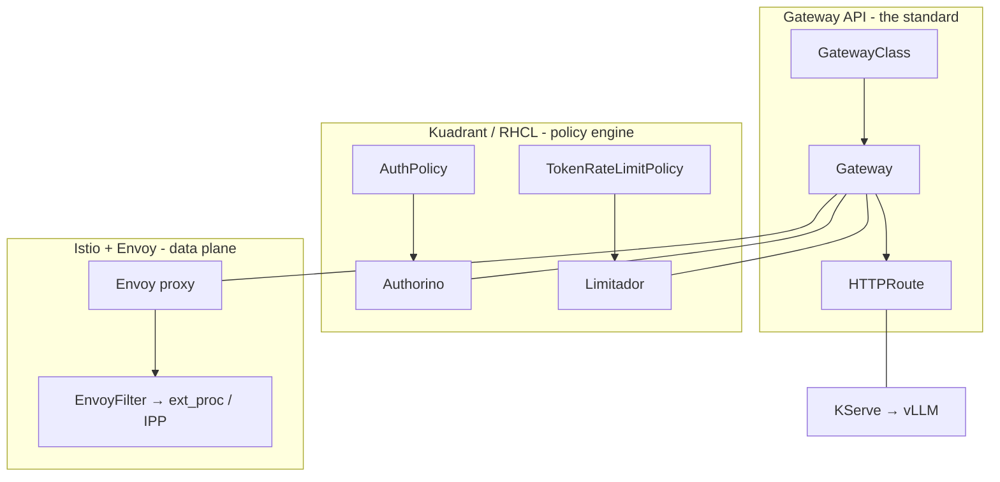

### Gateway API
- **What:** the modern, standard Kubernetes API for ingress/traffic routing — the successor to `Ingress`. It splits responsibilities into role-oriented resources: **`GatewayClass`** (the implementation), **`Gateway`** (a listener/entry point, owned by cluster ops), and **`HTTPRoute`** (routing rules, owned by app teams).
- **Why:** standardized, portable, extensible, and its persona model maps cleanly to MaaS's admin/owner/consumer split. Policies can attach to a Gateway or HTTPRoute.
- **In MaaS:** everything enters through a shared `Gateway` named **`maas-default-gateway`** (in `openshift-ingress`). Each model gets an **HTTPRoute** attached to it. A cluster admin must create the Gateway; MaaS only *reads* it.

### Kuadrant (and RHCL)
- **What:** **Kuadrant** is a cloud-native connectivity/policy framework that *extends* Gateway API with attachable policies — `AuthPolicy`, `RateLimitPolicy`, `TokenRateLimitPolicy`, `DNSPolicy`, `TLSPolicy`. It bundles two engines: **Authorino** (auth) and **Limitador** (rate limiting).
- **Why:** instead of coding auth/rate-limiting into each app, you *declare* a policy CR and attach it to a route/gateway. Kuadrant programs Envoy to enforce it.
- **RHCL = Red Hat Connectivity Link:** the **productized, supported downstream** of Kuadrant that ships with RHOAI. Same concepts and CRs; enterprise support and its own version numbers.
- **In MaaS:** the `maas-controller` translates MaaS's own CRDs into Kuadrant CRs — `MaaSAuthPolicy` → `AuthPolicy`, `MaaSSubscription` → `TokenRateLimitPolicy`. **ODH uses community Kuadrant (1.4.2+); RHOAI uses RHCL (1.3+/1.4.1+).** The version floor exists because credential-stripping needs Authorino v0.23.1+.

### Authorino
- **What:** a Kubernetes-native **external authorization** service. It implements Envoy's **`ext_authz`** hook, so the proxy asks Authorino "should I allow this request?" before forwarding. Authorino supports many identity sources: API keys, OIDC/JWT, Kubernetes **TokenReview**, mTLS — and it can **manipulate request headers**.
- **Why:** offloads authentication/authorization from every backend into one declarative, auditable place, and can rewrite/strip credentials.
- **In MaaS, Authorino:**
  1. Authenticates the caller — **API key** (calls `maas-api` `/internal/v1/api-keys/validate`), **OIDC JWT** (Tech Preview), or **OpenShift TokenReview**. Order: API key → OIDC → TokenReview.
  2. Confirms access via `maas-api` `/internal/v1/subscriptions/select`.
  3. **Strips/replaces the `Authorization` header** before the request reaches the model (credential protection); can inject per-model credentials from a Secret.
  4. Passes identity/subscription context to Limitador (but **not** as headers to the model).

### Limitador
- **What:** Kuadrant's **rate-limiting** service, also integrated with Envoy. It keeps counters and answers "is this caller over the limit?"
- **Why:** centralized, fast, and — importantly — **token-aware**: it can read a numeric field from the response.
- **In MaaS:** enforces per-subscription **token** rate limits from `TokenRateLimitPolicy`. It reads **`usage.total_tokens`** from the model's response body. (Consequence: only endpoints that return `usage.total_tokens` — i.e. `/v1/chat/completions` — are token-rate-limited; `/v1/messages` and `/v1/responses` are not.)

### KServe
- **What:** the Kubernetes model-serving platform (autoscaling, canary, standardized inference protocol). Its `LLMInferenceService` CRD is the LLM-focused entry point.
- **Why:** don't build serving from scratch; get GPU management, routing, and lifecycle for free.
- **In MaaS:** serves on-cluster models. MaaS reads the KServe-created HTTPRoute and the LLMISVC `status` (readiness, endpoint, resolved model alias). Note: KServe is **no longer a hard prerequisite** — the platform also supports external-only models.

### Istio & Envoy
- **What:** **Istio** is the service mesh; **Envoy** is the high-performance proxy that is its data plane. **EnvoyFilter** is an Istio CR to inject custom Envoy configuration. **ext_authz** and **ext_proc** are Envoy extension points (external authorization; external *processing* of request/response bodies).
- **Why:** MaaS needs to inspect and modify request/response bodies (for body-based routing and credential injection) and to reach external services through the mesh.
- **In MaaS:** an **EnvoyFilter** inserts the **payload-processing (IPP)** ext_proc filters around the Kuadrant auth filter; external models use Istio `ServiceEntry`/`DestinationRule` for egress + TLS origination.

### Supporting dependencies
- **PostgreSQL** — durable store for API-key *hashes* + metadata (pgx driver, golang-migrate migrations). Required for production.
- **OpenTelemetry / Prometheus / Grafana / Perses / Loki** — metrics, dashboards, and structured usage logs.
- **cert-manager** — issues TLS certs (used on non-OpenShift where the OpenShift service-CA isn't available).
- **LeaderWorkerSet (LWS)** — a workload API KServe uses for multi-node model serving; installed as a prereq.
- **Konflux / Tekton** — the Red Hat build pipeline producing the container images.

### ✅ Check your understanding
- What's the difference between Gateway API and Kuadrant? *(Standard routing vs attachable policies on top of it.)*
- What is RHCL and how does it relate to Kuadrant?
- Which Envoy hook does Authorino use, and which does payload-processing use? *(ext_authz vs ext_proc.)*
- Why can Limitador count tokens but only on some endpoints?

---

## 6. Tech stack at a glance

| Layer | Technology | Why chosen |
|---|---|---|
| Platform | OpenShift (K8s 4.19.9+) | Enterprise K8s; target of ODH/RHOAI |
| Traffic | **Gateway API** (OpenShift-native impl) | Standard, portable, persona-aligned |
| Policy engine | **Kuadrant** (ODH) / **RHCL** (RHOAI) | Declarative `AuthPolicy` + `TokenRateLimitPolicy` |
| AuthN/Z | **Authorino** | External authorizer; validates + strips creds |
| Rate limiting | **Limitador** | Token-aware counters |
| Serving | **KServe** (`LLMInferenceService`) + **vLLM** | Standard serving + fast OpenAI-compatible engine |
| Mesh / data plane | **Istio + Envoy** (EnvoyFilter, ext_proc) | Body-based routing, payload processing, egress |
| Backend language | **Go 1.25** | controller-runtime ecosystem; FIPS toolchain |
| HTTP framework | **Gin** (maas-api) | Lightweight router + middleware |
| Controller framework | **kubebuilder / controller-runtime** | Standard operator scaffolding |
| State store | **PostgreSQL** (pgx + golang-migrate) | Durable API-key metadata (hash only) |
| Frontend | **React** | Admin/consumer UI |
| Observability | Prometheus, Grafana + **Perses**, **OpenTelemetry**, **Loki** | Metrics, dashboards, usage logs |
| Packaging | **Kustomize**, **Konflux/Tekton**, UBI9 FIPS images | GitOps-friendly Red Hat build pipeline |

---

## 7. High-level architecture

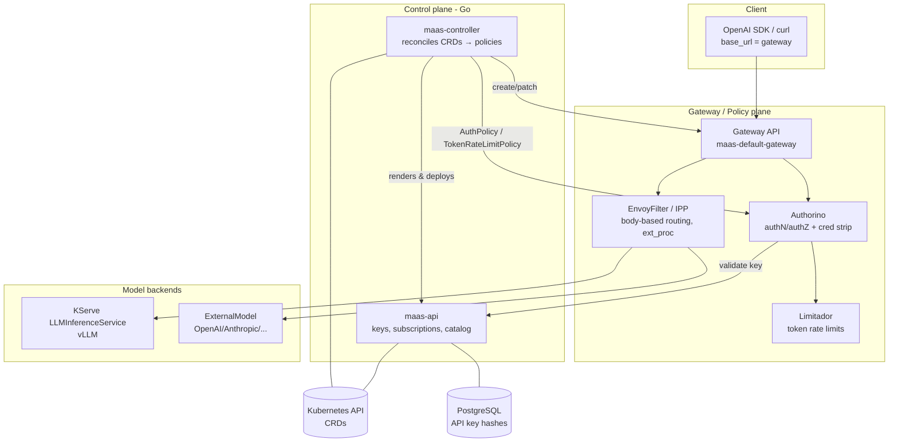

**Two planes to keep straight:**
- **Control plane (config time):** `maas-controller` watches CRDs and *materializes* them into Gateway API + Kuadrant resources. `maas-api` manages keys/subscriptions/catalog.
- **Data plane (request time):** Gateway → Authorino (calls back into `maas-api` to validate keys / select subscription) → Limitador → EnvoyFilter/IPP → model.

**Non-obvious but important:** `maas-controller` is the **only deployer of `maas-api`**. On bootstrap it renders `maas-api/deploy/overlays/odh` *in-process* (kustomize), post-renders per-tenant values in Go, and server-side-applies it. There is **no separate `kubectl apply` of maas-api**.

### ✅ Check your understanding
- Trace an inference request through every box above.
- Who deploys maas-api, and how?
- Where does Authorino get the answer "is this key valid"?

---

## 8. The data model — CRDs explained

All types live in `maas-controller/api/maas/v1alpha1/`. Group: `maas.opendatahub.io/v1alpha1`.

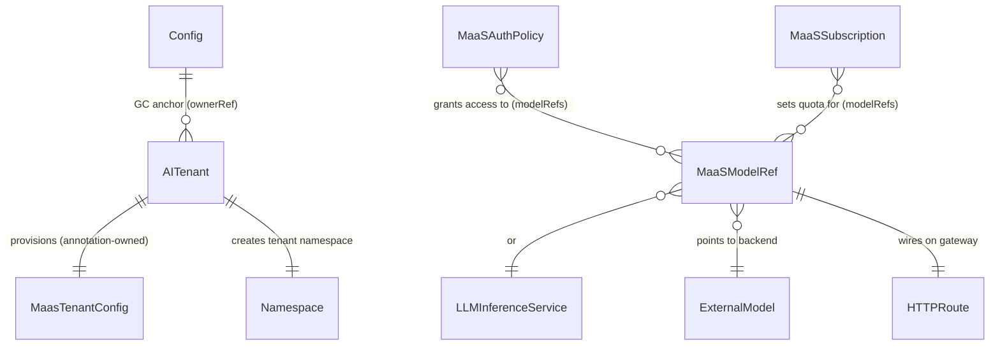

| CRD | Scope | Purpose | Materializes into |
|---|---|---|---|
| **`Config`** (singleton `default`, cluster) | GC anchor + platform toggles (`UsageLogging`, `LimitadorScrapeInterval`) | — |
| **`AITenant`** (`ai-tenants` ns) | Tenant bootstrap: gateway ref + OIDC; provisions tenant namespace + config + admin RBAC | Namespace, Roles, gateway claim |
| **`MaasTenantConfig`** (`default-tenant`) | Per-tenant runtime config: API-key policy, telemetry | Feeds the maas-api render |
| **`Tenant`** *(deprecated)* | Legacy predecessor; split into AITenant + MaasTenantConfig | — |
| **`MaaSModelRef`** | Publishes a model; points to `LLMInferenceService` or `ExternalModel`; resolves endpoint & route | HTTPRoute status, resolved alias |
| **`MaaSAuthPolicy`** | **Access gate**: `modelRefs` + `subjects{groups,users}` (≥1 required) | Kuadrant `AuthPolicy` (Authorino `AuthConfig`) |
| **`MaaSSubscription`** | **Rate gate**: `owner` + per-model `tokenRateLimits{limit,window,billingRate}` + `priority` | Kuadrant `TokenRateLimitPolicy` (Limitador) |
| **`ExternalModel`** | Off-cluster provider: `provider`, `endpoint`, `credentialRef` (Secret), `targetModel` | Istio Service/ServiceEntry/DestinationRule/HTTPRoute |

**Key field notes:**
- `MaaSSubscription…tokenRateLimits[]`: `Limit` (1..1e9), `Window` regex `^[1-9]\d{0,3}(s|m|h)$` — **`d`/days was removed**; plus `Priority`, `BillingRate`, `TokenMetadata`.
- `MaaSModelRef.status`: `Phase` (Pending/Ready/Unhealthy/Failed/Invalid), `Endpoint`, `HTTPRouteName/Namespace`, `GatewayName/Namespace`, `Hostnames`, **`ResolvedModelAlias`**, `ResolvedTenantRef`.
- `MaaSModelRef.spec.modelRef.kind` ∈ {`LLMInferenceService`, `ExternalModel`}, plus optional `EndpointOverride`, `TenantRef`.
- **Two different `ExternalModel` kinds exist:** `maas.opendatahub.io/ExternalModel` (MaaS's own) and `inference.opendatahub.io/ExternalModel` (upstream, which MaaSModelRef can also read). Naming code prefixes `maas-` to avoid collisions.

**Shared types (`common_types.go`):** a `Phase` enum, condition types `GovernanceAttached` / `RuntimeReady`, a ~20-value `ConditionReason` enum, and `ResourceRefStatus{Name,Namespace,Ready,Reason,Message}`.

### ✅ Check your understanding
- Draw the relationship between `Config`, `AITenant`, `MaasTenantConfig`.
- Which CRD becomes a Kuadrant `AuthPolicy`? Which becomes a `TokenRateLimitPolicy`?
- What is `ResolvedModelAlias` and why does it matter for body-based routing?

---

## 9. Component deep-dive: maas-controller

A kubebuilder / controller-runtime operator (Go 1.25, controller-runtime v0.22.5). Registers **seven reconcilers** in `cmd/manager/main.go`.

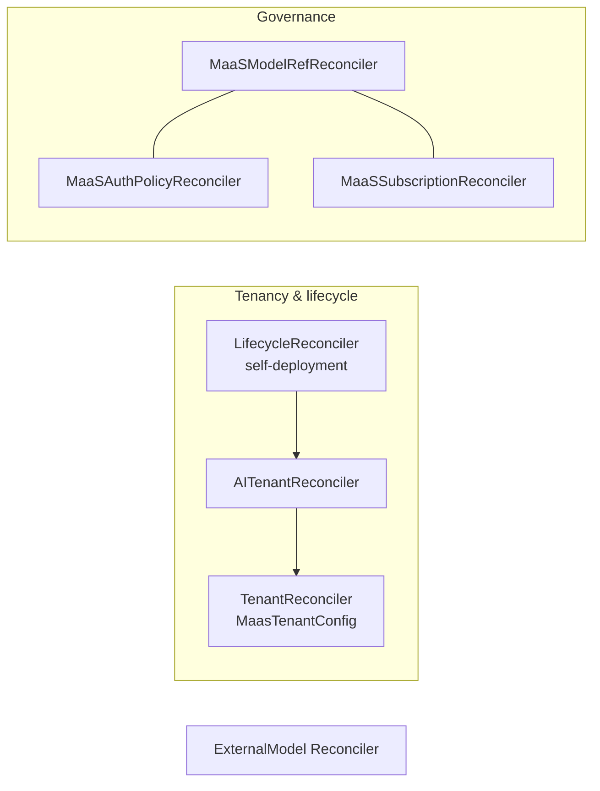

1. **`LifecycleReconciler` (self-deployment)** — watches the controller's **own Deployment** as a lifecycle anchor. Sole creator of `Config/default`; links the default `AITenant` + `MaasTenantConfig` to `Config` via non-controller OwnerRefs; deploys observability (Limitador `ServiceMonitor`, Perses dashboards, usage-logs OTel collector — gated by `Config.Spec.UsageLogging`). **Teardown is orchestrated in Go** (via Deployment annotations `teardown-requested` → `teardown-completed`), *not* via finalizers. The Deployment intentionally has **no** OwnerRef to `Config` so the workload survives `Config` deletion.

2. **`AITenantReconciler`** — bootstraps a tenant: validates placement, creates the tenant namespace + `MaasTenantConfig` + two Roles (tenant-admin, object-admin), enforces **one-AITenant-per-Gateway** via a claim ConfigMap. The default tenant is *namespace-first* (so the UI isn't blocked on gateway readiness); other tenants are *gateway-first*. Deletion revokes tenant API keys (via a Job), releases the namespace (keeps user content), and has a `DeletionTimeout` force-remove escape hatch.

3. **`TenantReconciler`** — reconciles `MaasTenantConfig` (and legacy `Tenant`). This is the reconciler that **renders and deploys maas-api + payload-processing** per tenant (`tenantreconcile.RunPlatform`). Handles a management-state annotation (Managed/Removed/Unmanaged), validates gateway existence, and requeues every 5 min.

4. **`MaaSModelRefReconciler`** — the **join point** of governance. Dispatches through a **provider abstraction** (`GetBackendHandler(kind)`): resolves the route, computes status, resolves the model alias, then checks **governance attached** (is there a matching subscription+authpolicy pair?) and **model-identity uniqueness** (alias-collision detection for BBR). No timed requeue — fully watch/error driven.

5. **`MaaSAuthPolicyReconciler`** — turns `MaaSAuthPolicy` into a **singleton gateway-level Kuadrant `AuthPolicy`** (`maas-gateway-auth`). One policy serves *all* models: model identity is resolved dynamically via **CEL** from the request path / `X-Gateway-Model-Name`. Ready requires the Kuadrant policy to be both **Accepted AND Enforced**.

6. **`MaaSSubscriptionReconciler`** — turns `MaaSSubscription` into per-model Kuadrant `TokenRateLimitPolicy` (`maas-trlp-<model>`), targeting and owned by the HTTPRoute. Limit key `<safeKey>-<model>-tokens`, with a `when` predicate on `auth.identity.selected_subscription_key`, and exempts `/v1/models`.

7. **`ExternalModel` reconciler** — wires an external provider into the Istio mesh: creates an ExternalName `Service`, `ServiceEntry`, `DestinationRule` (only when TLS), and `HTTPRoute`. Uses **owner references (no finalizer)** — GC handles cleanup.

### The canonical reconcile pattern

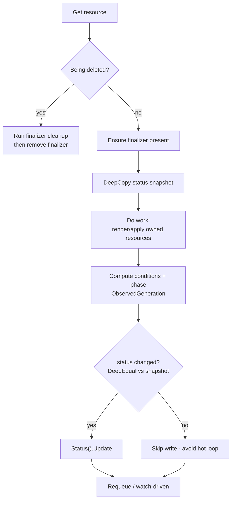

**Patterns worth naming:**
- **Finalizers** for ordered cleanup (`*-cleanup`); *deliberately none* on ExternalModel & self-deployment (GC / Go orchestration instead).
- **Owner references & GC layering:** `Config` → tenants → children; Kuadrant policies owned by HTTPRoute/Gateway. Cross-namespace ownership (which K8s OwnerRefs can't express) done via **annotations**.
- **Watches + predicates + mappers:** `GenerationChangedPredicate`; map functions fan HTTPRoute/subscription/authpolicy/LLMISvc events back to affected `MaaSModelRef`s (alias-based, avoiding O(N²)).
- **Dynamic optional-CRD watches:** `registerWatchWhenCRDAppears` + `sync.Once` handle optional CRDs (KServe, Kuadrant TRLP, Perses, OTel) gracefully — the controller doesn't crash-loop if they aren't installed yet.
- **SSA platform pipeline:** kustomize render → Go post-render → `client.Apply` with `ForceOwnership` + `FieldOwner("maas-controller")` — mirrors how the ODH operator deploys components.
- **Provider abstraction:** `BackendHandler`/`RouteResolver` interfaces keyed by `ModelRef.Kind`; the reconciler never `switch`es on kind.
- **RBAC-escalation prevention:** the controller must itself hold every permission it grants downstream (why `TenantReconciler`'s RBAC markers are the broadest).

### ✅ Check your understanding
- Walk the standard reconcile loop. Why the DeepEqual guard before `Status().Update`?
- Why does ExternalModel use no finalizer but MaaSModelRef does?
- How does the controller avoid crash-looping when Kuadrant/KServe CRDs are absent?
- Why a *single* gateway AuthPolicy instead of one per model?

---

## 10. Component deep-dive: maas-api

The HTTP control-plane service (Go 1.25, **Gin**). Manages API keys, resolves subscriptions, serves the model catalog, and is the **callback target for Authorino**.

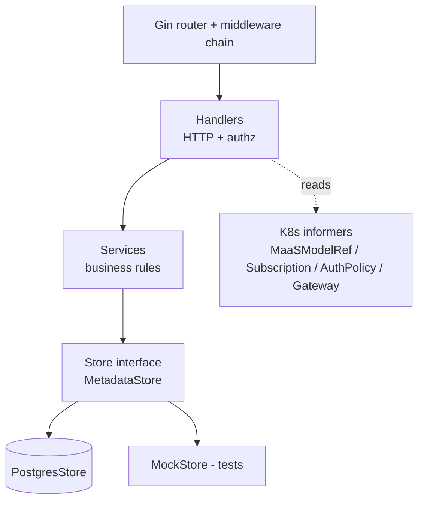

**Middleware chain** (`cmd/server.go`): `Recovery` → `BodyLimit` (1 MiB, 413) → `RequestID` → `AccessLogger` → tracing (OTel) → metrics (Prometheus). Two auth flavours per route group: **strict** (`ExtractUserInfo`, 500 if no identity headers) and **optional** (`ExtractUserInfoOptional`, empty list if no identity).

### The three auth mechanisms
1. **Identity-header trust** (most user routes): Authorino authenticates the OpenShift token upstream, then injects `X-MaaS-Username` / `X-MaaS-Group`. maas-api *trusts* these. (Client-forged `X-MaaS-*` headers are explicitly denied — a security fix.)
2. **Kubernetes TokenReview + SubjectAccessReview** (`/v1/tenants` only): validates the bearer token via `TokenReviews().Create`, then a SAR that the user is `system:authenticated`.
3. **RBAC admin detection**: a SAR asking "can this user `create maasauthpolicies`?" wrapped in a **`CachedAdminChecker`** (30s positive / 2s negative TTL) — gates cross-user / cross-subscription key operations. **Tenant isolation is enforced even for admins.**

### API keys — crypto & lifecycle
Key format: `sk-oai-{key_id}_{secret}`.
- `key_id` = 96 bits base62; `secret` = 256 bits base62.
- **Stored value is only `SHA-256(key_id + "\x00" + secret)`** — plaintext shown **once**, never persisted.
- Validation: O(1) hash lookup + `subtle.ConstantTimeCompare` (timing-safe).
- Groups are **snapshotted at creation** (immutable) and validated against an allowlist regex to prevent CEL/JSON injection into downstream AuthPolicy.
- **Ephemeral keys** (≤1h, auto-named, excluded from search, GC'd by a cleanup CronJob endpoint).
- Fail-closed: a key with no bound subscription is invalid.
- `last_used_at` updates are **async + debounced** per-key (a `sync.Map` + CAS) to avoid Postgres row-lock storms.

### Database
Single table **`api_keys`** (`id, username, name, key_hash, status, user_groups[], created_at, expires_at, last_used_at, ephemeral, subscription, tenant`, plus a `labels` JSONB column and a `description` field — added for organisational tracking/management; `labels` is GIN-indexed for `@>` containment queries and CHECK-constrained to a JSON object). **Tenant isolation is enforced in every query** (writes reject cross-tenant with `ErrTenantMismatch`; uniqueness is per-tenant). Migrations run at startup via **golang-migrate** over an embedded FS. `GetByHash` is the hot validation path and lazily flips expired keys to `expired`.

### Subscription selection
`MaaSSubscription` CRs are read from an **informer cache** (unstructured) and parsed. Selection is explicit (`namespace/name`) or auto: single accessible → use it; multiple → `MultipleSubscriptionsError`; none → `NoSubscriptionError`. `SelectHighestPriority` sorts by *priority desc → maxLimit desc → name asc*. Health gating differs between key-creation (lenient) and inference (strict — checks TRLP readiness).

> **Worth remembering:** there is **no user-facing token-minting endpoint**. The `token` package only *extracts* identity from headers; the "token mint" metric actually counts API-key creation.

### ✅ Check your understanding
- Why store only the hash, and why `ConstantTimeCompare`?
- Why snapshot groups at key-creation time? What's the downside?
- Why debounce `last_used_at`?
- What returns 404 instead of 403, and why?

---

## 11. The gateway / policy layer

Where request-time enforcement happens. Kuadrant vocabulary:

| Kuadrant resource | Enforces | Backed by | HTTP on failure |
|---|---|---|---|
| `AuthPolicy` (`kuadrant.io/v1`) | **Access** | Authorino (`AuthConfig`) | 401 / 403 |
| `TokenRateLimitPolicy` (`kuadrant.io/v1alpha1`) | **Token quota** | Limitador | 429 |

**Body-based routing (BBR) & IPP** (Istio ext_proc / "Inference Payload Processing"): an **EnvoyFilter** (`payload-processing`, priority 10) inserts two ext_proc filters around Kuadrant's auth filter:
- **`ipp-pre`** (INSERT_BEFORE auth) — extracts the JSON body `model` field into header `X-Gateway-Model-Name` (this *is* body-based routing) and resolves the provider. `failure_mode_allow: true`.
- **`ipp`** (INSERT_AFTER auth) — `maas-headers-guard` → `stream-usage-enforcer` → `model-provider-resolver` → `api-translation` (off by default, on for Anthropic) → `apikey-injection`. Full-duplex streamed so SSE passes through. `failure_mode_allow: false`.

The `ipp` filter must run **after** Kuadrant's wasm filter (priority ordering) — otherwise body-routed `/v1/*` requests return `404 NR`. ext_proc is disabled per-route on the four maas-api routes (`/v1/models`, `/v1/subscriptions`, `/v1/api-keys`, `/maas-api/*`).

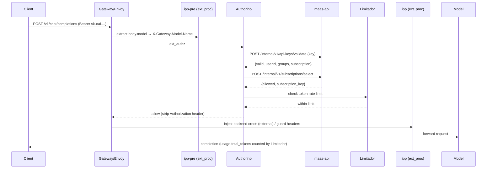

### ✅ Check your understanding
- Which component returns 401 vs 403 vs 429?
- Why must the `ipp` EnvoyFilter run *after* the Kuadrant wasm filter?
- How does Limitador count *tokens* rather than requests, and where does that not work?

---

## 12. Model serving inside MaaS

*(Ties §4 fundamentals to the concrete repo mechanics.)*

**On-cluster models (KServe + vLLM):**
- Model owner deploys an `LLMInferenceService` with `spec.router.gateway.refs → maas-default-gateway`. KServe runs vLLM and creates the HTTPRoute.
- MaaS **does not own** that HTTPRoute — it *discovers* it by label selector (`app.kubernetes.io/component: llminferenceservice-router`, `part-of: llminferenceservice`) and validates its `parentRefs`.
- Readiness comes from `LLMInferenceService.status.conditions[Ready]`; the endpoint from `status.addresses[*]` (MaaS prefers the BBR address `gateway-external-model-routing` over path-based `gateway-external`).
- **`status.resolvedModelAlias`** = `publishers/{namespace}/models/{model-name}` (populated by KServe). MaaS mirrors it into `MaaSModelRef.status.resolvedModelAlias`; this is the routing identity BBR matches on and `maas-api` uses for subscription reverse-lookup. Alias collisions are flagged (`ModelIdentityUnique`) because BBR can't disambiguate duplicates.

**External models:** an `ExternalModel` CR (provider, targetModel, endpoint FQDN, `credentialRef` → Secret key `api-key`) drives a reconciler that creates an **ExternalName Service**, Istio **ServiceEntry** (`MESH_EXTERNAL`), **DestinationRule** (TLS origination), and an **HTTPRoute** with both a path rule and an `X-Gateway-Model-Name` header-match rule. The provider key is injected at the gateway by the IPP `apikey-injection` plugin (OpenAI `Authorization: Bearer`, Anthropic `x-api-key`, Azure `api-key`); `api-translation` converts formats. External models are default-tenant-only (Tech Preview) and appear in `/v1/models` when `status.phase == Ready` (no endpoint probing — the user's token can't carry the provider key).

**Inference itself is not served by maas-api.** maas-api only serves `/v1/models`, `/v1/subscriptions`, `/v1/api-keys`, `/maas-api/*`. Inference goes straight through the gateway to the backend. Responses are OpenAI-shaped; streaming uses SSE (`data:` chunks → `data: [DONE]`), kept flowing by the full-duplex ext_proc modes.

### ✅ Check your understanding
- Who creates the HTTPRoute for an on-cluster model — KServe or MaaS?
- What is `resolvedModelAlias` and where does its value originate?
- How is an external provider's API key kept secret from the caller?

---

## 13. Key workflows

### A. Admin publishes & governs a model
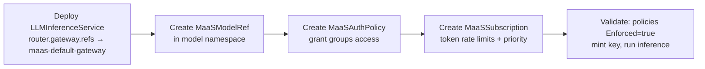

### B. Consumer mints a key & calls inference
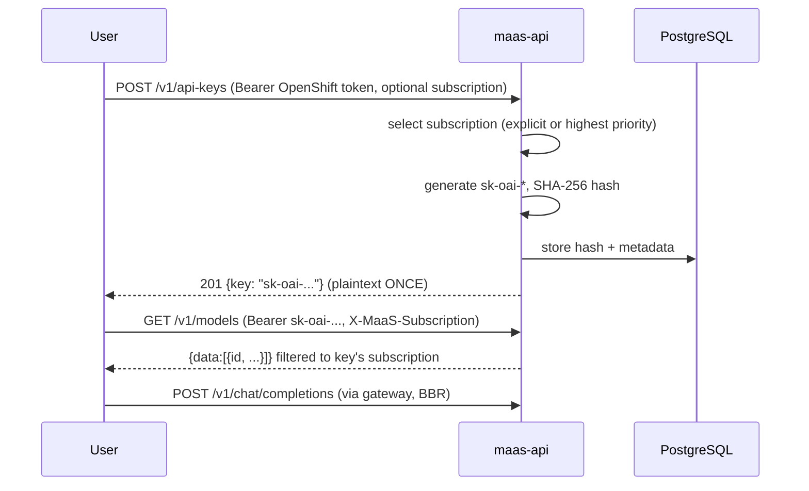

### C. Platform bootstrap (deploy)
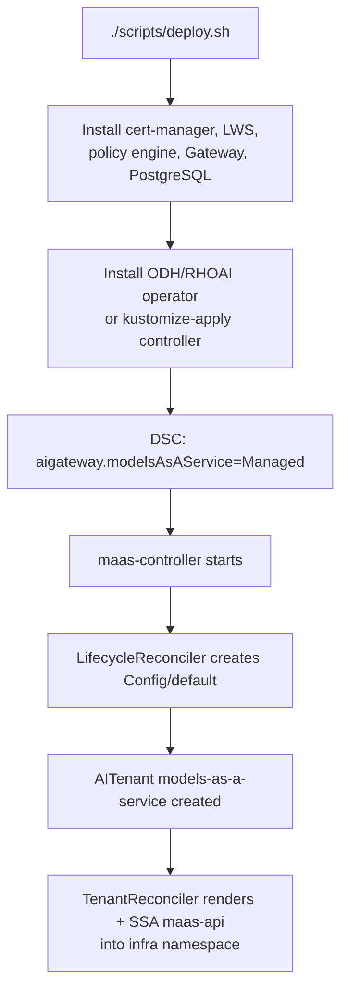

### ✅ Check your understanding
- In workflow B, what happens if the user omits `subscription`?
- Why is the plaintext key shown only once?
- In workflow C, name the component that actually creates maas-api.

---

## 14. API reference

### User-facing / management
| Method | Path | Auth | Purpose |
|---|---|---|---|
| `GET` | `/health` | none | Liveness |
| `GET` | `/v1/models` | optional | OpenAI-style catalog, filtered to caller's access; `Cache-Control: no-store` |
| `GET` | `/v1/subscriptions` | optional | Subscriptions the user can access |
| `GET` | `/v1/model/:model-id/subscriptions` | optional | Subscriptions including a model |
| `GET` | `/v1/api-keys/config` | strict | `{max_expiration_days, ephemeral_max_expiration}` |
| `POST` | `/v1/api-keys` | strict | Create key → 201, plaintext **once** |
| `GET` | `/v1/api-keys/:id` | strict | Key metadata (**404 not 403** on unauthorized — anti-IDOR) |
| `DELETE` | `/v1/api-keys/:id` | strict | Revoke |
| `POST` | `/v1/api-keys/search` | optional | Filtered/sorted/paginated list (non-admins forced to own keys) |
| `POST` | `/v1/api-keys/bulk-revoke` | strict | Bulk/dry-run revoke (subscription/other-user scope = admin only) |
| `GET` | `/v1/tenants` | TokenReview+SAR | Tenant + gateway metadata |

### Internal (Authorino / CronJob; not client-facing)
| Method | Path | Caller | Notes |
|---|---|---|---|
| `POST` | `/internal/v1/api-keys/validate` | Authorino | **Always HTTP 200** even for invalid keys (`{valid:false}`) |
| `POST` | `/internal/v1/subscriptions/select` | Authorino | **All errors return HTTP 200** with `error`/`phase` fields (Authorino contract) |
| `POST` | `/internal/v1/api-keys/cleanup` | CronJob | GC expired ephemeral keys |
| `DELETE` | `/internal/v1/tenants/:tenant/api-keys` | controller Job | Revoke all keys for a tenant (on teardown) |

> Internal endpoints return **200 with a body flag** rather than 4xx, because Authorino's external-authz contract distinguishes *the authorizer being reachable* from *the decision*.

### ✅ Check your understanding
- Why does `/internal/v1/api-keys/validate` return 200 for an *invalid* key?
- Why is `GET /v1/api-keys/:id` 404 (not 403) when you don't own the key?
- Which endpoints are token-rate-limited and which aren't?

---

## 15. Design patterns catalogue

**Controller (`maas-controller`)**
- Reconcile loop with deletion/finalizer branches and a DeepEqual status guard.
- Finalizers for ordered cleanup; no-finalizer + GC where ordering isn't needed.
- Owner references for GC layering; annotations for cross-namespace "ownership".
- Predicates + event mappers to minimise reconciles and fan related events.
- Dynamic optional-CRD watches (`sync.Once`) for graceful degradation.
- Server-side apply pipeline (render → post-render → apply).
- Provider/strategy abstraction (`BackendHandler` by kind).
- Sentinel errors driving phase transitions.
- RBAC-escalation prevention (controller holds all it grants).
- Singleton + CEL gateway AuthPolicy (one policy, dynamic per-model identity).

**API (`maas-api`)**
- Layered handler → service → store with an interface (`MetadataStore`) and compile-time assertion `var _ MetadataStore = (*PostgresStore)(nil)`.
- Interface-based DI (`AdminChecker`, `MetricsRecorder`, `SubscriptionSelector`).
- Decorator/caching (`CachedAdminChecker` wraps `SARAdminChecker`).
- Informer + generic lister adapter for CRDs.
- Typed error → HTTP status mapping via `errors.As`.
- Security patterns: fail-closed validation, constant-time compare, 404-for-IDOR, log redaction, structured audit records, per-key async debounce.
- Bounded concurrency (semaphore) for parallel model probing.

### ✅ Check your understanding
- Give a concrete example of the strategy pattern in this codebase.
- Why an interface for the store?
- What's the decorator here and what does it add?

---

## 16. Deployment, packaging & ecosystem integration

**Two Go modules, no root `go.mod`/`Makefile`.** Kustomize is the deployment substrate.

### Kustomize layout
- `deployment/base/maas-controller/` — CRDs, RBAC, webhook, manager Deployment, monitoring. `default/` is the **operator-bootstrap bundle** (generates `maas-parameters` ConfigMap from `params.env`; uses kustomize **replacements** to inject image + infra namespace).
- `deployment/base/maas-api/` — **rendered by the controller, not applied by deploy.sh**. `overlays/tls` (HTTPS 8443, DestinationRule, service-ca).
- `deployment/base/payload-processing/` — Istio ext_proc (IPP): EnvoyFilter, plugins ConfigMap.
- `deployment/components/` — kustomize **Components** (injected, can't build standalone): `infra-namespace-separation`, `odh/kserve`, `odh/operator`, `observability`.
- `deployment/overlays/` — `openshift/` and `xks/` (non-OpenShift; swaps OCP service-ca for cert-manager).

### The runtime-render trick (headline architectural fact)
`maas-controller` **renders `maas-api/deploy/overlays/odh` in-process** with kustomize (`krusty`), then a Go **PostRender** step remaps the placeholder `opendatahub` namespace to the tenant namespace, sets images from `RELATED_IMAGE_*` env vars, injects env, rewrites HTTPRoute parentRefs/backendRefs to the per-tenant Service, and edits EnvoyFilter config (gRPC cluster names, priority vs Kuadrant). Multi-tenant isolation via a `maas.opendatahub.io/tenant-instance` label. Then SSA-applies. The Dockerfile `COPY`s these manifests **into the controller image** so it can render at runtime.

### Deploy script (`scripts/deploy.sh`)
Modes: `operator` (default — the ODH/RHOAI operator deploys the controller; deploy.sh **fails loudly** if it doesn't, to catch integration gaps) vs `kustomize` (this repo installs the controller directly). Order: prereqs (cert-manager, LWS, policy engine, Gateway, PostgreSQL) → operator/DSC → **Phase 1** apply CRDs & wait `Established` → **Phase 2** apply controller bundle → wait ≤600s for the Tenant reconciler to create `maas-api`.

### Ecosystem integration
- Enabled via `DataScienceCluster` → `spec.components.aigateway.modelsAsAService.managementState=Managed` (3.5+); legacy `kserve.modelsAsService` (3.4) auto-migrated.
- **`RELATED_IMAGE_*` handoff:** the parent operator injects sub-component images onto the ODH operator CSV; the controller reads them at render time.
- **RBAC coupling (critical process rule):** any maas-controller RBAC change must be **mirrored** in `opendatahub-io/ai-gateway-operator` and `opendatahub-io/opendatahub-operator`.
- **Policy engine per operator:** ODH → community Kuadrant 1.4.2; RHOAI → RHCL.

### Packaging
Multi-stage, **FIPS-oriented** UBI9 images (`GOEXPERIMENT=strictfipsruntime`, non-root `USER 1001`). `.konflux` Dockerfile variants pin bases by digest + add Red Hat product labels; built by **Konflux/Tekton** → `quay.io/opendatahub/{maas-api,maas-controller}`.

### ✅ Check your understanding
- Why does the controller image bundle the maas-api manifests?
- What is `RELATED_IMAGE_*` and who sets it?
- Why does deploy.sh in *operator* mode refuse to fall back to kustomize?
- What are kustomize Components and why can't they build standalone?

---

## 17. Testing & CI

**maas-api tests:** `testify` only (no ginkgo/gomega); Gin `TestMode`; `httptest`; a hand-written in-memory `MockStore`; K8s `client-go/fake`. `make test` = `go test -race -coverprofile`.

**maas-controller tests:** `testify` + `gomega` with the **controller-runtime fake client + `interceptor.Funcs`** (to simulate API errors/conflicts). **No envtest, no ginkgo suite.** Table-driven.

**E2E (`test/e2e/`):** **pytest** (shells out to `oc`/`kubectl`). ~20 test files: api-keys, subscriptions (auth 200/401/403/429 + TRLP rate limiting), models endpoint, external models, external OIDC/Keycloak per-tenant isolation, negative/security (header spoofing), NetworkPolicy, and an extensive multi-tenancy suite. Uses the **llm-d simulator** for models.

**Smoke test (`test/e2e/scripts/prow_run_smoke_test.sh`):** prereqs → deploy platform → deploy 3 simulator models + policies → wait for AuthPolicies `Enforced` → set up admin/regular/premium tokens → `validate-deployment.sh` → pytest. Gated by env flags: `SKIP_DEPLOYMENT`, `SKIP_VALIDATION`, `SKIP_AUTH_CHECK` (default true — TLS chicken-egg), `EXTERNAL_OIDC`, `DEPLOY_MODE`, `POLICY_ENGINE` (default rhcl), etc.

**GitHub Actions:** manifest validation + `verify-codegen`; golangci-lint + govulncheck + `make test` per module; OpenAPI validation (Spectral + oasdiff); PR-title Conventional Commits; chaos/CRD breaking-change diff; main→stable→rhoai promotion crons.

> **Codegen rule:** change anything under `maas-controller/api/` or a `//+kubebuilder:rbac:` marker → run `make -C maas-controller generate manifests` and commit generated files; CI rejects stale codegen.

### ✅ Check your understanding
- How do you unit-test a reconciler without a real cluster?
- Why pytest for E2E instead of Go?

---

## 18. Advanced topics

**Multi-tenancy (Tech Preview):** `AITenant` (platform context) + `MaasTenantConfig` (runtime config) → isolated namespaces, gateways, maas-api instances, per-tenant OIDC, per-tenant DB rows. One-AITenant-per-Gateway enforced via a claim ConfigMap.

**Credential stripping:** requires Kuadrant 1.4.2+/Authorino v0.23.1+. Authorino validates the caller credential, then removes/replaces `Authorization` before the request reaches the model. For external models it *injects* backend creds from a Secret.

**Body-based routing (BBR) + IPP:** single `base_url`; ext_proc reads `body.model` → `X-Gateway-Model-Name`; requires the payload-processing EnvoyFilter ordered after Kuadrant's wasm.

**Token rate limiting nuance:** Limitador reads `usage.total_tokens` — so only `/v1/chat/completions` is token-rate-limited; Anthropic `/v1/messages` and OpenAI `/v1/responses` are not (auth/access still apply). Only *total* tokens (no input/output split) pending upstream wasm-shim changes.

**Auth modes & order:** API key → OIDC JWT (TP) → OpenShift TokenReview.

**Observability:** Limitador/Authorino/Istio/vLLM metrics → Prometheus → Grafana + Perses dashboards + Loki usage logs; OTel collector for structured usage logs. maas-api itself exposes no business metrics beyond HTTP/pod status.

**FIPS compliance** since v0.1.0.

### ✅ Check your understanding
- Explain the exact attack credential stripping defeats and the version dependency.
- Why can't you token-rate-limit `/v1/messages`?
- How is one-AITenant-per-Gateway enforced?

---

## 19. Advantages, disadvantages & trade-offs

### Advantages
- **Declarative, GitOps-friendly** governance (CRDs → policy).
- **Separation of concerns:** access vs quota; control vs data plane.
- **Standards-based:** Gateway API + OpenAI compatibility → low client friction, portability.
- **Security-first:** credential stripping, hash-only key storage, tenant isolation, anti-IDOR, FIPS.
- **Operable:** self-deployment, self-teardown, graceful degradation when optional CRDs absent.
- **Extensible:** provider abstraction for new backends; external models.

### Disadvantages / limitations
- **Heavy prerequisite stack:** OpenShift + Kuadrant/RHCL + KServe + PostgreSQL + Istio.
- **Tight upstream coupling:** RBAC mirrored across two parent-operator repos; version lockstep.
- **Token limiting only on chat completions** (not `/messages`, `/responses`); only total tokens.
- **Shared-HTTPRoute caveat:** multiple ModelRefs on one route → only one TRLP enforced (others `Overridden`).
- **Frozen key membership:** groups/subscription snapshotted at key creation → recreate keys after role changes; revoke on offboarding.
- **Tech Preview surface:** multi-tenancy, external models, OIDC JWT.
- **maas-api dependence:** if it's down, key create/validate and API-key inference fail (revocation immediate, but Authorino may cache briefly).
- **No never-expiring keys;** ephemeral ≤1h.

### Notable trade-offs
| Decision | Trade-off |
|---|---|
| Snapshot groups at key creation | Simplicity/perf & injection-safety **vs** staleness after role changes |
| Single CEL gateway AuthPolicy | Fewer resources, simpler **vs** all model identity logic in CEL |
| Internal endpoints return 200 | Matches Authorino contract **vs** unusual REST semantics |
| Controller renders maas-api at runtime | Per-tenant flexibility, operator-owned lifecycle **vs** hidden magic, harder to hand-apply |
| Hash-only key storage | Security **vs** cannot recover a lost key (must reissue) |

### ✅ Check your understanding
- Pick one trade-off and argue the *other* side.
- If maas-api is down, what still works and what breaks?

---

## 20. Challenges tackled during development

*(Drawn from real change history — concrete engineering problems.)*

- **Security hardening:** deny client-forged `X-MaaS-*` identity headers; restrict debug CORS to localhost; request body-size limit to prevent OOM; remove DB credentials from error messages; 404-instead-of-403 for IDOR; unverified-JWT parsing guards.
- **Credential exfiltration prevention:** the entire Kuadrant 1.4.2+ dependency exists to strip auth headers before backends.
- **EnvoyFilter ordering & Istio compatibility:** payload-processing must apply *after* Kuadrant wasm (else 404 NR); `workloadSelector` added for Istio 1.26; ext_proc timeouts tuned.
- **Reconcile correctness:** race conditions in default-tenant bootstrap; "requeue quietly on stale-cache conflict"; false-positive readiness during teardown.
- **Rate-limit edge cases:** shared-HTTPRoute override; resolving body-routed model names in AuthPolicy; CEL `has()` guards on telemetry labels; Authorino bracket-wrapped groups parsing.
- **Migration pain:** `Tenant` → `MaasTenantConfig` + `AITenant`; `MaaSModel` → `MaaSModelRef` (dropped tier-based access); DB secret migration to infra namespace; removing `X-MaaS-Tenant` header.
- **Graceful degradation:** don't crash-loop when Kuadrant/KServe CRDs absent; skip OpenShift-only watchers on non-OCP (xKS).
- **Upgrade safety:** preserve MaaS traffic during upgrades; verify AuthPolicy `Enforced` before e2e calls; wait for both `Accepted` and `Enforced`.
- **CVE remediation cadence:** repeated `golang.org/x/net`, `x/crypto` bumps; govulncheck.

### ✅ Check your understanding
- Describe a concurrency bug you'd expect in a multi-reconciler operator and how you'd fix it.
- What's the risk of parsing an unverified JWT, and where is it acceptable?

---

## 21. Glossary

- **Inference** — running a trained model to get an output; for LLMs, prompt → generated tokens.
- **Token** — a chunk of text (~¾ word); the unit that cost/latency and rate limits scale with.
- **Model serving** — hosting a model behind a network API (batching, scaling, health).
- **vLLM** — high-throughput LLM inference engine with an OpenAI-compatible API; runs inside KServe pods.
- **KServe / LLMInferenceService** — Kubernetes serving platform / its LLM CRD.
- **llm-d** — distributed-inference project; in this repo it appears as the *simulator*, the *payload-processor config API* (`llm-d.ai/v1alpha1`), and an indirect `gateway-api-inference-extension` dep.
- **LLM simulator** — a mock model server (no weights/GPU) used in CI (`llm-d-inference-sim`).
- **Gateway API** — standard K8s traffic-routing API (GatewayClass/Gateway/HTTPRoute).
- **Kuadrant / RHCL** — policy engine extending Gateway API / its Red Hat downstream.
- **Authorino** — external authorizer (validates creds, strips headers).
- **Limitador** — rate limiter (token-aware).
- **Istio / Envoy / EnvoyFilter / ext_authz / ext_proc** — mesh / proxy / config CR / auth hook / body-processing hook.
- **IPP / BBR** — Inference Payload Processing / body-based routing (route by `body.model`).
- **AITenant / MaasTenantConfig / Tenant(legacy)** — tenant bootstrap / per-tenant runtime config / deprecated predecessor.
- **MaaSModelRef / MaaSAuthPolicy / MaaSSubscription / ExternalModel** — model pointer / access gate / rate gate / external-provider descriptor.
- **Dual-check gate** — access needs BOTH a matching AuthPolicy AND a Subscription.
- **`sk-oai-*` key** — programmatic API key; SHA-256 hashed, shown once.
- **maas-default-gateway** — the shared Gateway models attach to; only these are governed/listed.
- **RELATED_IMAGE_*** — env vars the parent operator uses to hand sub-component images to the controller.
- **SSA / SAR / TokenReview** — server-side apply / SubjectAccessReview / TokenReview.
- **ResolvedModelAlias** — `publishers/{ns}/models/{name}`; the BBR routing identity.

---

## 22. Q&A / FAQ

### Fundamentals
**Q: In one sentence, what is MaaS?**
A: A Kubernetes-native control plane that turns raw LLM endpoints on OpenShift into a governed, multi-tenant, self-service, OpenAI-compatible product with access control, token rate limiting, credential protection, and usage metering.

**Q: What problem does it solve?**
A: Raw model endpoints have no built-in notion of who can call them, how much, how to bill/track, or how to protect the caller's credential. MaaS supplies all of that as a shared platform layer.

**Q: What is the "dual gate"?**
A: Two independent checks — access (`MaaSAuthPolicy` → Authorino, 403) and quota (`MaaSSubscription` → Limitador, 429). A caller must pass both.

**Q: Difference between training and inference?**
A: Training teaches the model (expensive, once); inference uses it to generate outputs (per-request). MaaS governs inference traffic.

**Q: What's the relationship between vLLM, KServe, and MaaS?**
A: vLLM is the inference engine; KServe is the serving platform that runs vLLM as an `LLMInferenceService`; MaaS is the governance/routing layer in front.

### Architecture
**Q: Walk me through an inference request.**
A: Client → Gateway → (ipp-pre extracts `body.model`) → Authorino (validate key via maas-api, select subscription, **strip Authorization**) → Limitador (token budget) → ipp (inject backend creds/guard headers) → model → response (Limitador counts `usage.total_tokens`).

**Q: Control plane vs data plane?**
A: Control plane = maas-controller (CRDs → Gateway/Kuadrant policy) + maas-api (keys/subscriptions/catalog). Data plane = Gateway/Envoy + Authorino + Limitador + model, at request time.

**Q: Who deploys maas-api?**
A: The controller's Tenant reconciler renders `maas-api/deploy/overlays/odh` in-process with kustomize, post-renders per-tenant values in Go, and SSA-applies it. Manifests are baked into the controller image.

**Q: Why one gateway-level AuthPolicy instead of per-model?**
A: Model identity is resolved dynamically via CEL (from path / `X-Gateway-Model-Name`), so a single policy governs all models — fewer resources, simpler enforcement.

### Dependencies
**Q: What is Kuadrant and what is RHCL?**
A: Kuadrant is a Gateway-API policy framework (Authorino + Limitador); RHCL (Red Hat Connectivity Link) is its supported downstream shipped with RHOAI. ODH uses Kuadrant; RHOAI uses RHCL.

**Q: What exactly does Authorino do here?**
A: Validates the caller (API key / OIDC / TokenReview), calls maas-api to confirm access, strips/replaces the `Authorization` header, and can inject backend creds.

**Q: Why does the version floor (Kuadrant 1.4.2 / Authorino 0.23.1) exist?**
A: That's the version that added `Authorization`-header stripping, required for credential protection.

**Q: What is "llm-d" in this repo?**
A: Not a full distributed-inference stack — it's the CI *simulator* (`llm-d-inference-sim`), the payload-processor config API group (`llm-d.ai/v1alpha1`), and an indirect `gateway-api-inference-extension` dependency.

### Controller internals
**Q: Describe the reconcile loop.**
A: Get → deletion/finalizer branch → ensure finalizer → snapshot status → do work → compute conditions+phase with ObservedGeneration → write status only if changed (DeepEqual guard) → requeue or rely on watches.

**Q: Why the DeepEqual guard?**
A: A status write triggers another reconcile; writing unconditionally causes a hot loop and API churn.

**Q: When do you *not* use a finalizer?**
A: When GC via owner references suffices (ExternalModel's Istio children) or when teardown is orchestrated in Go (self-deployment). Finalizers are for *ordered* cross-resource cleanup.

**Q: How does it survive missing optional CRDs (Kuadrant/KServe)?**
A: `registerWatchWhenCRDAppears` + `crdExists` + `sync.Once` — watch for the CRD to appear, then register typed watches, instead of crash-looping.

**Q: What is RBAC-escalation prevention?**
A: K8s blocks a controller from granting permissions it doesn't hold; so the controller's RBAC must be a superset of everything it grants downstream.

### maas-api internals
**Q: How are API keys stored?**
A: Only `SHA-256(key_id + \x00 + secret)`. Plaintext shown once. Validation is O(1) hash lookup + constant-time compare.

**Q: Why constant-time compare?**
A: To avoid timing side-channels that could leak the secret.

**Q: Why snapshot groups at creation, and the downside?**
A: Immutability/perf and injection safety. Downside: membership goes stale after role changes → recreate key; revoke on offboarding.

**Q: Why do internal endpoints return 200 even on failure?**
A: Authorino's external-authz contract — the *decision* is in the body; a non-200 would signal the *authorizer itself* failed.

**Q: How is tenant isolation enforced in the DB?**
A: Every query binds `tenant`; writes reject cross-tenant with `ErrTenantMismatch`; uniqueness index is per-tenant — even for admins.

### Deployment / ops
**Q: Why no root go.mod/Makefile?**
A: Two independent modules (controller, api) with separate lifecycles and images.

**Q: What are kustomize Components here?**
A: Reusable `kind: Component` fragments injected into a parent kustomization (`infra-namespace-separation`, `kserve`, `observability`) — can't build standalone.

**Q: What breaks if you forget `make generate manifests`?**
A: CI's `verify-codegen` fails; CRD YAML/deepcopy drift from the Go types.

### Security
**Q: Explain credential stripping and its version dependency.**
A: Authorino validates the token/key but strips/replaces `Authorization` before forwarding, so a compromised model can't harvest it. Needs Kuadrant 1.4.2+/Authorino 0.23.1+.

**Q: Name three security patterns in the code.**
A: Hash-only key storage + constant-time compare; 404-instead-of-403 (anti-IDOR); deny client-forged identity headers; fail-closed validation; log redaction; body-size limit.

### Trade-offs / opinion
**Q: Biggest weakness of the design?**
A: Heavy prerequisite/coupling surface and token-limiting gaps (only chat completions, total tokens). Defensible because it targets ODH/RHOAI specifically.

**Q: What would you improve first?**
A: Input/output token split + rate limiting on `/messages` & `/responses`; the shared-HTTPRoute TRLP override; and reducing key-membership staleness (dynamic group resolution).

**Q: How would you scale the control plane?**
A: `MaxConcurrentReconciles` (tunable, clamped 1–10), leader election (on), informer cache scoping, field indexes to avoid O(N²) fan-out, and Authorino/SAR caching (present).

### Rapid-fire
- 401 vs 403 vs 429? → auth failure / access denied / rate limited.
- Which CRD → TokenRateLimitPolicy? → MaaSSubscription.
- Model routing identity for BBR? → ResolvedModelAlias (`publishers/{ns}/models/{name}`).
- Where are API-key hashes stored? → PostgreSQL `api_keys` table.
- Default gateway name/namespace? → `maas-default-gateway` / `openshift-ingress`.
- Policy engine: ODH vs RHOAI? → Kuadrant vs RHCL.
- Inference engine? → vLLM. CI model? → llm-d simulator.
- Frontend? → React. Backend lang? → Go 1.25.
- What's shown only once? → the plaintext API key.

---

## 23. References & further reading

### Blog series — MaaS internals (hands-on)
A practitioner series on how the platform actually works, in reading order:

1. **Protecting enterprise AI: How to manage API keys in Models-as-a-Service (MaaS)** — Ishita Sequeira & Jamie Land, Jun 15 2026. The API-key lifecycle: minting, hashing, validation, revocation.
   <https://www.redhat.com/en/blog/protecting-enterprise-ai-how-manage-api-keys-models-service-maas>
2. **Models-as-a-Service (MaaS) governance: Managing AI access and token quotas** — Chaitanya Kulkarni, Jul 21 2026. The two-gate model: `MaaSAuthPolicy` (access) + `MaaSSubscription` (token quotas) enforced in parallel.
   <https://www.redhat.com/en/blog/models-service-maas-governance-managing-ai-access-and-token-quotas>
3. **Track model usage with the OpenShift AI 3.4 usage dashboard** — Red Hat Developer, Jul 6 2026. The usage-tracking / metering follow-on: observability, chargeback, and the cardinality trade-off of `captureUser`.
   <https://developers.redhat.com/articles/2026/07/06/track-model-usage-openshift-ai-usage-dashboard>

### Related articles & announcements
- **Introducing Models-as-a-Service in OpenShift AI** — Red Hat Developer, Nov 25 2025 (the launch overview).
  <https://developers.redhat.com/articles/2025/11/25/introducing-models-service-openshift-ai>
- **Model-as-a-Service: How to run your own private AI API** — Red Hat Developer, Jun 12 2026 (consumer-facing walkthrough).
  <https://developers.redhat.com/articles/2026/06/12/model-service-how-run-your-own-private-ai-api>
- **Scaling enterprise AI: Delivering Models-as-a-Service with Red Hat OpenShift AI 3.4** — Red Hat blog.
  <https://www.redhat.com/en/blog/scaling-enterprise-ai-delivering-models-service-openshift-ai-34>
- **A guide to Models-as-a-Service** — Red Hat resource overview.
  <https://www.redhat.com/en/resources/models-as-a-service-overview>

### Official documentation
- **Govern LLM access with Models-as-a-Service** — Red Hat OpenShift AI product docs.
  <https://docs.redhat.com/en/documentation/red_hat_openshift_ai_self-managed/3.3/html/govern_llm_access_with_models-as-a-service/use-models-as-a-service_maas>
- **Project documentation site** (OpenDataHub MaaS).
  <https://opendatahub-io.github.io/models-as-a-service/>

### Source & code exploration
- **Source repository** — `opendatahub-io/models-as-a-service`.
  <https://github.com/opendatahub-io/models-as-a-service>
- **DeepWiki** — auto-generated, browsable code walkthrough of the repo.
  <https://deepwiki.com/opendatahub-io/models-as-a-service>

### Key upstream dependencies
- **Gateway API** — <https://gateway-api.sigs.k8s.io/>
- **Kuadrant** (Authorino + Limitador) — <https://docs.kuadrant.io/> · Authorino <https://github.com/Kuadrant/authorino> · Limitador <https://github.com/Kuadrant/limitador>
- **Red Hat Connectivity Link (RHCL)** — <https://docs.redhat.com/en/documentation/red_hat_connectivity_link>
- **KServe** — <https://kserve.github.io/website/> · **vLLM** — <https://docs.vllm.ai/> · **llm-d** — <https://llm-d.ai/>

---

*This is a living reference — update sections as the platform evolves.*
