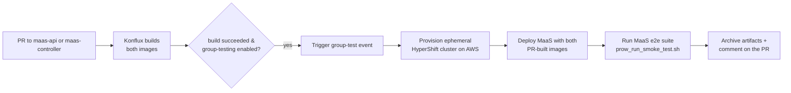
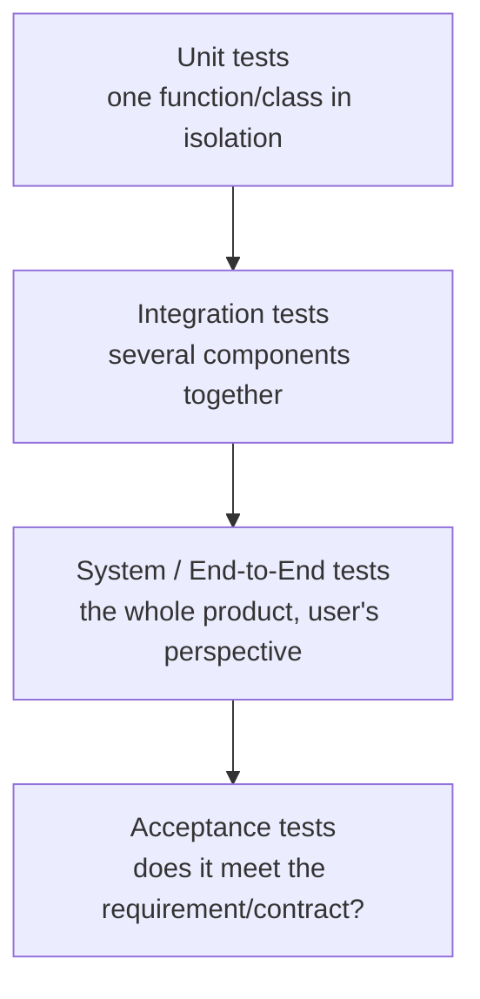
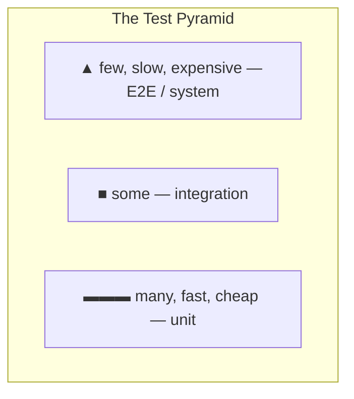
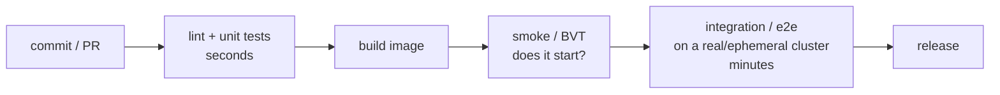
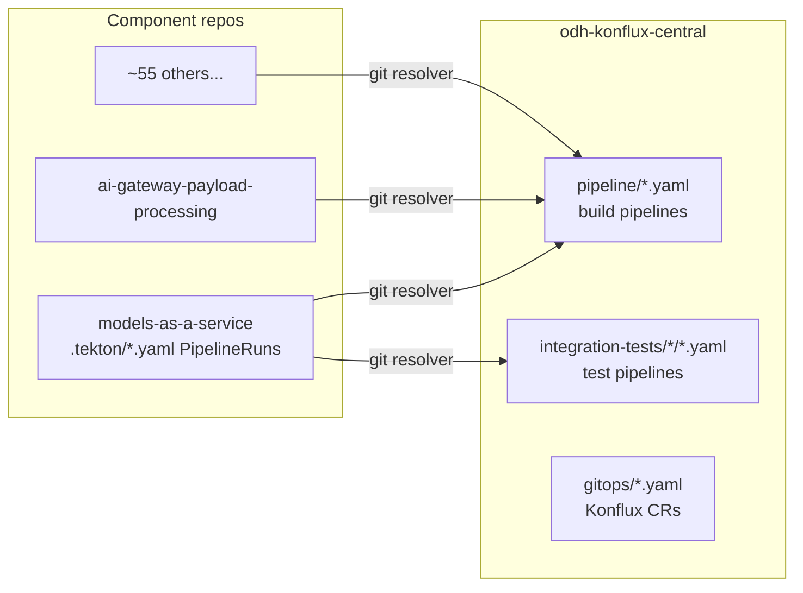
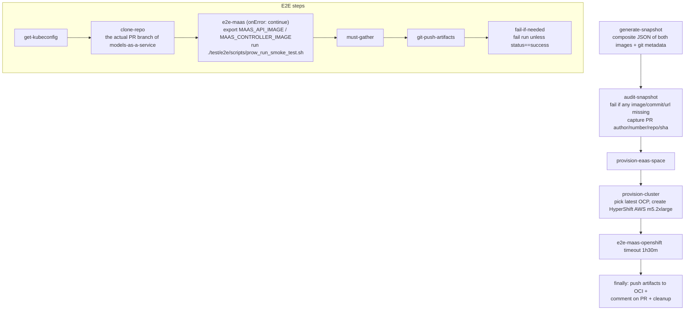
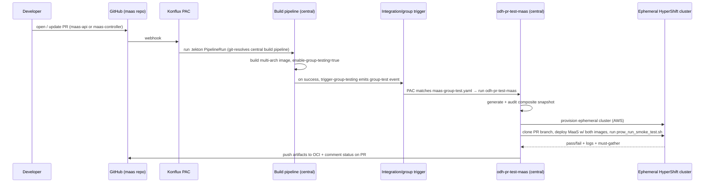

# odh-konflux-central & CI Testing for MaaS — A Complete Technical Guide

> A beginner-friendly, in-depth reference for **`opendatahub-io/odh-konflux-central`** — the central Konflux CI/CD configuration repo for OpenDataHub / OpenShift AI — with a deep focus on how the **Models as a Service (MaaS)** integration tests run.
>
> It doubles as a **primer on software testing itself**: what integration testing is, and how unit / integration / smoke / e2e / regression / load tests differ and fit together. Read top-to-bottom to learn it, or jump to any section. Each section ends with **✅ Check your understanding** prompts, and there's a **Q&A / FAQ** at the end.

**Repo:** `opendatahub-io/odh-konflux-central` · **What it holds:** Konflux (Tekton) pipelines, PipelineRuns, and GitOps CRs for every ODH/RHOAI component · **No product source code lives here.**

---

## Table of contents

1. [Executive summary](#1-executive-summary)
2. [Foundations: what is CI/CD, Tekton & Konflux](#2-foundations-what-is-cicd-tekton--konflux)
3. [Software testing — a complete primer](#3-software-testing--a-complete-primer)
4. [What `odh-konflux-central` is](#4-what-odh-konflux-central-is)
5. [The Konflux object model](#5-the-konflux-object-model)
6. [Repository structure](#6-repository-structure)
7. [The MaaS integration test — deep dive](#7-the-maas-integration-test--deep-dive)
8. [How a MaaS PR flows through CI end-to-end](#8-how-a-maas-pr-flows-through-ci-end-to-end)
9. [How the pieces map to testing theory](#9-how-the-pieces-map-to-testing-theory)
10. [Design patterns & mechanics](#10-design-patterns--mechanics)
11. [Advantages, limitations & gotchas](#11-advantages-limitations--gotchas)
12. [Glossary](#12-glossary)
13. [Q&A / FAQ](#13-qa--faq)
14. [References & further reading](#14-references--further-reading)

---

## 1. Executive summary

**One-liner:** *`odh-konflux-central` is the single source of truth for the CI/CD pipelines of the whole OpenDataHub ecosystem — every component repo (including MaaS) remotely references the Tekton pipelines defined here rather than carrying its own.*

For **MaaS specifically**, this repo defines the **group integration test**: when you open a PR that changes `maas-api` or `maas-controller`, Konflux builds both container images, then runs a **single cross-component test** that spins up a **throwaway OpenShift cluster on AWS**, deploys MaaS using *both freshly-built images together*, and runs the MaaS end-to-end test suite against it. If it passes, the PR is green; either way, logs and a `must-gather` are archived and a comment is posted back on the PR.

The two ideas to hold onto:
1. **Central pipelines, remote reference.** Component repos have thin `.tekton/` files that *point at* pipelines in this repo via the Tekton **git resolver**. Fix a pipeline once here → every component gets it.
2. **Integration = build the pieces, test them together on a real cluster.** MaaS's `maas-api` + `maas-controller` from the *same PR* are deployed together (a "composite snapshot") — that's what makes it an *integration* test rather than a per-component unit test.

---

## 2. Foundations: what is CI/CD, Tekton & Konflux

*Skip if you already know these; otherwise this makes the rest readable.*

### 2.1 CI/CD in one minute
- **CI (Continuous Integration):** every code change is automatically built and tested, so problems surface within minutes of a commit instead of at release time.
- **CD (Continuous Delivery/Deployment):** those validated builds are automatically packaged and made ready to ship (or shipped).
- A **pipeline** is the ordered set of automated steps (build → test → package → release) a change goes through.

### 2.2 Tekton
**Tekton** is a Kubernetes-native CI/CD framework. Instead of a CI server with its own config language, Tekton expresses pipelines *as Kubernetes resources*:
- **`Task`** — a sequence of **steps** (each step is a container running a command).
- **`Pipeline`** — a DAG (directed graph) of Tasks, wired by `runAfter` ordering and by passing **params** and **results** between them.
- **`PipelineRun`** — one *execution* of a Pipeline (with concrete parameter values). Every run is a pod-orchestrated K8s object you can inspect with `kubectl`.
- **`StepAction`** — a reusable single step; **workspaces** — shared volumes between tasks; **results** — small string outputs a task publishes for later tasks.

### 2.3 Konflux
**Konflux** (Red Hat's productized build of the upstream `konflux-ci` / AppStudio project) is a **secure software supply-chain platform built on Tekton**. On top of raw Tekton it adds:
- **Pipelines-as-Code (PAC):** a push/PR to a git repo automatically triggers a `PipelineRun` defined in that repo's `.tekton/` directory.
- **A build/release object model** (`Application`, `Component`, `Snapshot`, `IntegrationTestScenario` — see §5).
- **The Integration Service:** watches for new builds (Snapshots) and launches the matching integration tests.
- **EaaS (Environment as a Service):** provisions **ephemeral clusters** on demand for tests, then tears them down.
- Supply-chain security (provenance, SBOMs, signed images).

> **Mental model:** *Tekton is the engine (pipelines as K8s objects). Konflux is the car built around it (PAC triggers, build/release model, ephemeral test clusters, supply-chain security). `odh-konflux-central` is the shared garage of blueprints every ODH component drives out of.*

### ✅ Check your understanding
- What's the difference between a `Pipeline` and a `PipelineRun`?
- What does Konflux add on top of plain Tekton?
- What does "Pipelines-as-Code" trigger, and from where?

---

## 3. Software testing — a complete primer

*This section is standalone theory — it's the "types of testing, in depth" you asked for. §9 then maps it onto what this repo actually does.*

### 3.1 Why test, and the core vocabulary
Testing exists to answer two questions cheaply and repeatedly: **"does it do what we intended?"** (functional) and **"does it hold up under real conditions?"** (non-functional). Two framings run through everything below:
- **Test *levels*** — *how much of the system* is under test (one function → the whole product).
- **Test *purposes*** — *what property* you're checking (correctness, speed, resilience, security…).

### 3.2 Test levels (smallest → largest scope)

- **Unit test** — exercises the *smallest* piece (a function, a method) in **isolation**, with its collaborators replaced by **test doubles** (see 3.5). Fast (milliseconds), numerous, run on every save. *Example in MaaS:* `maas-api`'s `service_test.go` verifying key-hashing logic with a `MockStore`.
- **Integration test** — exercises **two or more real components working together** — code + database, service + service, controller + real Kubernetes API. Slower, fewer, catches the bugs that unit tests *can't* (wrong assumptions about how parts connect). *This is the category the MaaS group test falls into.*
- **System / End-to-End (E2E) test** — drives the **entire assembled product** the way a real user or client would — through its public interface, on a realistic environment, with nothing mocked. Slowest, fewest, highest confidence. *Example:* deploy the whole MaaS platform on a cluster, mint an API key, call the models endpoint, assert a 200/403/429.
- **Acceptance test** — checks the system satisfies an agreed **requirement or contract** (business or technical). Often overlaps with E2E but framed around "did we build the right thing."

> The line between "integration" and "E2E" is fuzzy and teams draw it differently. A useful rule: **integration** = "do these specific parts connect correctly"; **E2E** = "does the whole thing work for the user." The MaaS Konflux test is *called* an integration test (it validates `maas-api`+`maas-controller` together) but *runs* a full E2E deploy-and-verify — both labels are defensible.

### 3.3 The test pyramid (and its shape)
The **test pyramid** is the guiding heuristic for *how many* of each level to write:

- **Many unit tests** (fast feedback, pinpoint failures), **fewer integration**, **fewest E2E** (slow, flaky, expensive to run and maintain).
- **Anti-pattern — the "ice-cream cone":** mostly manual/E2E tests and few unit tests → slow, brittle, costly CI.
- A modern variant, the **"testing trophy,"** puts the largest weight on *integration* tests, arguing they give the best confidence-per-cost for many applications. Both agree on the extremes: lots of cheap unit tests, only a handful of full E2E runs.

### 3.4 Test purposes (what property you're checking)

**Functional** (is the behavior correct?):
- **Smoke test** — a quick, shallow "**is it fundamentally alive?**" check run *first*, before deeper testing. Named after hardware: "power it on; does smoke come out?" A failing smoke test means "don't bother running the rest." *In CI it's the fast gate.*
- **Sanity test** — a narrow check that one specific fix/area works, after a small change. (Often used interchangeably with smoke.)
- **Regression test** — re-runs existing tests to confirm **new changes didn't break previously-working behavior**. The bulk of a mature suite is de-facto regression protection.
- **Contract test** — verifies two services agree on their **API contract** (request/response shape) without running both fully — cheaper than E2E for catching interface drift.
- **BVT (Build Verification Test)** — a smoke test specifically gating **a freshly produced build/installer** ("does this build even install and start?"). Used here by the OLM-install flow.

**Non-functional** (does it hold up?):
- **Performance test** — measures speed/latency/throughput under expected load.
- **Load test** — behavior at *expected peak* load. **Stress test** — push *past* limits to find the breaking point. **Soak/endurance test** — sustained load over a long time (memory leaks, resource creep).
- **Scalability test** — behavior as you add users/nodes/data.
- **Security test** — vulnerability scanning, auth/authz checks, fuzzing. **Chaos test** — inject failures (kill pods, drop network) to verify resilience.

**By execution style / environment:**
- **Manual vs automated**; **canary / synthetic** (probe production continuously with fake traffic); **A/B**.

### 3.5 Test doubles — mocks, stubs, fakes & simulators
When a unit/integration test shouldn't hit a real dependency, you substitute a **test double**:
- **Stub** — returns canned answers ("this call always returns 42").
- **Mock** — a stub that *also* records/asserts *how* it was called.
- **Fake** — a working but simplified implementation (e.g. an **in-memory** database standing in for PostgreSQL — MaaS's `MockStore`).
- **Simulator** — a stand-in for an expensive external system that *behaves* like the real thing. *MaaS uses `llm-d-inference-sim`* — a mock LLM server that returns plausible responses **without GPUs or model weights**, so CI can test the governance/routing layer fast and cheaply.

### 3.6 Testing in a CI/CD context
Where each runs in a pipeline (fast/cheap first, so failures stop the line early):

Key CI concepts you'll meet in this repo:
- **Ephemeral environment** — a **throwaway cluster** created just for one test run and destroyed after (Konflux EaaS + HyperShift). Gives real-cluster fidelity without a permanent, drifting test cluster.
- **Flaky test** — a test that passes/fails non-deterministically (timing, ordering, external state). CI often adds warmups/retries (the MaaS repo has commits doing exactly this).
- **Artifacts & `must-gather`** — logs, cluster dumps, and reports saved from a run for debugging (especially failures).

### ✅ Check your understanding
- Order these by scope: E2E, unit, integration.
- What's the difference between a smoke test and a regression test?
- Stub vs mock vs fake vs simulator — give an example of each.
- Why run unit tests *before* building the image in CI?
- What is an ephemeral test environment and why prefer it over a shared cluster?

---

## 4. What `odh-konflux-central` is

The repo's own README is one sentence:

> *"odh-konflux-central — To centrally store the Konflux configuration for all the components."*

That's the whole idea. It is a **central configuration repository** — it holds **no product source code**. Instead it holds, for the entire OpenDataHub / RHOAI ecosystem:
- Reusable **Tekton `Pipeline`s** (build + test) in `pipeline/`.
- **PAC `PipelineRun` templates** in `pipelineruns/` (copied into each component repo's `.tekton/`).
- **Konflux GitOps CRs** (`Component`, `Application`, `IntegrationTestScenario`) in `gitops/`.
- **Per-component integration test pipelines** in `integration-tests/`.

**The key architectural idea — central pipelines, remote reference.** A component source repo (like `models-as-a-service`) does **not** carry full pipeline YAML. Its thin `.tekton/` PipelineRuns use the Tekton **git resolver** to pull pipeline definitions from *this* repo at `main`. Fix or improve a pipeline once here, and every one of ~55 components inherits it.

### ✅ Check your understanding
- Does product code live in this repo? Where does the MaaS *test logic* actually live?
- What does "central pipelines, remote reference" mean, and why is it valuable?

---

## 5. The Konflux object model

Concrete Konflux/AppStudio CR kinds you'll find in `gitops/` and `its.yaml`:

| Kind (API group) | What it is | Example here |
|---|---|---|
| **`Application`** (`appstudio.redhat.com/v1alpha1`) | Logical grouping of components | `opendatahub-builds` (CI), `opendatahub-release` (release), `group-testing` (cross-component integration) |
| **`Component`** (`appstudio.redhat.com/v1alpha1`) | Maps a git repo + Dockerfile → a container image | `odh-maas-api-ci`, `odh-maas-controller-ci` (`gitops/opendatahub-ci-components.yaml`) |
| **`IntegrationTestScenario`** (ITS, `.../v1beta2`) | Declares *which* test pipeline to run and *what* triggers it | git-resolves a pipeline from `integration-tests/`; `context` fields decide when it fires |
| **`Snapshot`** | A Konflux record of built component image(s) at a point in time | Built-in per-component; **MaaS instead uses a composite/group snapshot** (see §7) |
| **`PipelineRun`** (`tekton.dev/v1`, PAC-annotated) | One execution; the trigger unit | `pipelineruns/models-as-a-service/maas-group-test.yaml` |

**How they interact (the standard Konflux loop):**
1. PAC sees a PR → runs the repo's **`PipelineRun`** → git-resolves a **build `Pipeline`** → builds & pushes the **Component** image.
2. Konflux records a **Snapshot** of the new image(s).
3. The **Integration Service** matches the Snapshot to an **`IntegrationTestScenario`** → launches the test **PipelineRun**.
4. Release flows use the `opendatahub-release` Application + File-Based Catalog (FBC) fragments.

> **Boundary worth knowing:** the *authoritative*, actually-applied `IntegrationTestScenario`s and the `group-testing` Application definition are managed by **ArgoCD from an external GitLab repo** (`konflux-release-data`), not fully from this repo. The `gitops/` files here are partly reference/source (the `opendatahub-builds` Application header is even commented out). Don't overstate this repo as the live state.

### ✅ Check your understanding
- What does a `Component` map together? What does an `IntegrationTestScenario` decide?
- Where does the *live* ITS/GitOps state actually come from?

---

## 6. Repository structure

| Directory | Role |
|---|---|
| `pipeline/` | Reusable core build pipelines: `multi-arch-container-build.yaml` (the big one), `multi-arch-operator-build.yaml`, `-catalog-build.yaml`, `bundle-build.yaml`, `e2e-arch-build.yaml` (multi-arch: `x86_64, arm64, ppc64le, s390x`). |
| `pipelineruns/` | Per-component PAC `PipelineRun` templates (~55 component subdirs), copied into each component's `.tekton/`. |
| `integration-tests/` | Per-component integration/e2e Tekton `Pipeline`s + Dockerfiles + READMEs. Plus `template/` (onboarding scaffolds), `CI/` (nightly/operator-build triggers), `olminstall/` (OLM install BVT). |
| `gitops/` | Konflux CR manifests: `opendatahub-ci-components.yaml`, `opendatahub-release-components.yaml`, `opendatahub-integration-test-scenarios.yaml`, `integration-testing-prerequisites.yaml`. |
| `doc/` | `contributing-konflux-testing-rhoai.md` (the best in-repo glossary + workflow guide) and `doc/adr/` (architecture decision records). |
| `release-pipelines-archived/` | ~60 archived/historical release configs — **not active**, don't rely on them. |
| `.github/` | `odh-konflux-onboarder.yml` (generates config for a new component), `build-integration-images.yml`, yamllint, renovate. |
| `its.yaml` (root) | A sample standalone `IntegrationTestScenario` for the operator. |

**Testing patterns across components** (`integration-tests/<component>/`):
- **Group-testing pipelines** (`pr-group-testing-pipeline.yaml`): `models-as-a-service`, `ai-gateway-payload-processing`, `feast`, `kserve`, `kubeflow`, `notebooks`, + `template/`.
- **Single/PR test pipelines**: `distributed-workloads`, `kuberay`, `trainer`, `model-registry`, `odh-model-controller`, `opendatahub-operator`.
- **Special:** `olminstall/` (Snapshot+ITS OLM-install BVT), `CI/` (chains Konflux → GitHub Actions → Jenkins).

> MaaS and `ai-gateway-payload-processing` use **near-identical** group pipelines — the ai-gateway one's `Dockerfile` even says it "mirrors `Dockerfile.maas`."

### ✅ Check your understanding
- Which directory holds the build pipeline vs the test pipeline?
- Name two components that use group-testing and two that use single-PR testing.

---

## 7. The MaaS integration test — deep dive

Everything lives in `integration-tests/models-as-a-service/` (three files) plus the trigger in `pipelineruns/models-as-a-service/`.

### 7.1 The three files
- **`README.md`** — declares the Tekton `Pipeline` `odh-pr-test-maas`; runs MaaS e2e on an **ephemeral HyperShift cluster on AWS (EaaS)**; uses **both** `odh-maas-api-ci` and `odh-maas-controller-ci` images **from the same PR** (a **composite snapshot**, not a single-component Konflux Snapshot). The old per-component `pr-test-pipelinerun.yaml` is no longer maintained; MaaS runs **only** through the *group* path.
- **`pr-group-testing-pipeline.yaml`** — the `Pipeline` (`odh-pr-test-maas`) itself (below).
- **`Dockerfile.maas`** — source for the toolset image `quay.io/rhoai/rhoai-task-toolset:maas`: `FROM ubi9/go-toolset:1.25`, adds `jq`, `htpasswd` (`httpd-tools`), `kustomize`, `oc`, `kubectl`, `python`. This image runs the e2e and must-gather steps.

### 7.2 The pipeline DAG (`odh-pr-test-maas`)
Params: `group-components` (JSON map of Konflux component → repo), `oci-artifacts-repo` (default `quay.io/opendatahub/odh-ci-artifacts`), `artifact-browser-url`. Workspace: `git-auth`.

Task-by-task:
1. **`generate-snapshot`** (git-resolved from `rhoai-konflux-tasks`) — builds a **composite `SNAPSHOT`**: a JSON of images + git metadata for *all* group components.
2. **`audit-snapshot`** (`konflux-test:stable`) — iterates each component and **fails hard** if any `.image`, `git.commit`, or `git.url` is empty; captures PR metadata (author, number, repo, org, sha) via the PAC downward API.
3. **`provision-eaas-space`** — reserves an EaaS space.
4. **`provision-cluster`** — picks the latest supported OpenShift version, then **creates an ephemeral HyperShift cluster on AWS** (`m5.2xlarge`).
5. **`e2e-maas-openshift`** (timeout **1h30m**) — the core:
   - `get-kubeconfig` → `clone-repo` (clones the **actual PR branch** of `models-as-a-service`) → **`e2e-maas`**: exports `MAAS_API_IMAGE` / `MAAS_CONTROLLER_IMAGE` from the snapshot (fails if either image tag is null) and runs **`./test/e2e/scripts/prow_run_smoke_test.sh`** → `must-gather` → `git-push-artifacts` → **`fail-if-needed`**.
   - The e2e step uses `onError: continue` + a status file so that **artifacts and must-gather are collected even when tests fail**, and `fail-if-needed` re-asserts the failure *after* archiving.
6. **`finally` → `push-ci-artifacts-and-update-pr`** (always runs) — pushes artifacts to `quay.io/opendatahub/odh-ci-artifacts:<run>`, **posts a PR comment** with the test name, artifact link, and aggregate status, then cleans up the transient artifact branch.

### 7.3 What the e2e script actually does
The pipeline **delegates all test logic** to the MaaS repo's `test/e2e/scripts/prow_run_smoke_test.sh`. That script, on the ephemeral cluster:
1. Installs cert-manager + LeaderWorkerSet (KServe prereqs).
2. Deploys MaaS via kustomize (RHCL/Kuadrant, gateway, maas-api, maas-controller) — using the PR-built images from `MAAS_API_IMAGE`/`MAAS_CONTROLLER_IMAGE`.
3. Installs the ODH operator + DataScienceCluster (KServe).
4. Deploys fixtures: free + premium tiers, `LLMInferenceService` (simulator-backed), `MaaSModelRef`, `MaaSAuthPolicy`, `MaaSSubscription`.
5. Sets up admin + regular-user tokens.
6. Runs deployment validation.
7. Runs the pytest e2e suites (API keys, subscriptions, models, tenant, external OIDC…).

So: **odh-konflux-central owns *where/how* it runs (Konflux orchestration); the MaaS repo owns *what* is tested (the script + pytest).**

### 7.4 How it's triggered — "PR groups"
The trigger is `pipelineruns/models-as-a-service/maas-group-test.yaml`:
- Labels `application: group-testing`, `component: maas-group`, `type: test`.
- Fires on the **`group-test` event** (`on-cel-expression: event == "group-test"`) or a manual **`/group-test`** PR comment.
- `group-components`: `{ "odh-maas-api-ci": "opendatahub/maas-api", "odh-maas-controller-ci": "opendatahub/maas-controller" }`.

**Where the `group-test` event comes from:** the build pipeline `multi-arch-container-build.yaml` has an `enable-group-testing` param (default `"false"`). MaaS's PR build PipelineRuns set it to `"true"`. On a **successful** PR build, the pipeline's `trigger-group-testing` task emits the `group-test` event → PAC matches it to `maas-group-test.yaml`. Net effect:

> **PR → build both `maas-api` and `maas-controller` images → on build success, fire one group test that provisions a cluster and runs e2e against both freshly-built images together.**

That "both images from one PR, tested together" is precisely what makes it a **cross-component integration test** (and why the old per-component tests were retired — testing `maas-api` alone couldn't validate its interaction with `maas-controller`).

### ✅ Check your understanding
- Why does MaaS use a *composite* snapshot instead of a per-component Snapshot?
- What guarantees artifacts are saved even when the e2e tests fail?
- Which repo owns the test *logic*, and which owns the *orchestration*?
- Two ways the group test can be triggered?

---

## 8. How a MaaS PR flows through CI end-to-end

### ✅ Check your understanding
- Trace the path from "open PR" to "PR comment with results." Where is the ephemeral cluster created and destroyed?

---

## 9. How the pieces map to testing theory

Tying §3 back to what this repo does:

| Concept (from §3) | In odh-konflux-central / MaaS |
|---|---|
| **Unit tests** | Live in the *component repos* (`maas-api`/`maas-controller` Go tests with `MockStore`, fake K8s client) — run in the **build** pipeline, not here. |
| **Integration test** | The whole point of `odh-pr-test-maas`: `maas-api` + `maas-controller` from one PR, deployed and tested **together**. |
| **E2E / system test** | What `prow_run_smoke_test.sh` actually performs — full platform deploy + pytest through the real gateway. |
| **Smoke test / BVT** | The script is literally `prow_run_smoke_test.sh`; the MaaS repo treats it as *the* PR-gating smoke bar. `olminstall/` is a BVT for the operator install. |
| **Regression** | The pytest suites accrete over time; re-running them on every PR is regression protection. |
| **Simulator (test double)** | `llm-d-inference-sim` stands in for real GPU-backed models. |
| **Ephemeral environment** | EaaS + HyperShift throwaway cluster per run. |
| **Flaky-test handling** | MaaS commits add warmup+retry instead of naive polling; parallel e2e runs. |
| **Artifacts / must-gather** | Collected on every run (even failures) and pushed to OCI + linked in the PR comment. |

> **Naming caveat:** this test is *called* an "integration test" (Konflux term for cross-component), is triggered as a *group* test, runs a script named *smoke*, and does a full *e2e* deploy-and-verify. All four labels describe the same run from different angles — don't let the vocabulary confuse you.

### ✅ Check your understanding
- Where do MaaS *unit* tests run — here, or in the component repo's build?
- Justify calling this one run "integration," "smoke," and "e2e" simultaneously.

---

## 10. Design patterns & mechanics

- **Central config, remote reference** — component `.tekton/` PipelineRuns git-resolve pipelines from this repo; tasks/stepactions git-resolve from `konflux-ci/build-definitions` and `red-hat-data-services/rhoai-konflux-tasks`.
- **Composite/group snapshot** — a custom `generate-snapshot-for-group-testing` builds a multi-image snapshot; images are picked by jq key (`"odh-maas-api-ci".image`).
- **Ephemeral-cluster-per-run** — EaaS + HyperShift-on-AWS, OCP version auto-selected (latest supported); torn down after.
- **Collect-then-fail** — `onError: continue` on e2e/must-gather/artifact steps + a `test-status` file + a final `fail-if-needed` step ⇒ artifacts survive failures, run still fails correctly.
- **Delegation** — Tekton orchestrates infra; *all* test logic is the component repo's `prow_run_smoke_test.sh`. No test logic duplicated in YAML.
- **PAC downward API** — PR metadata (author, number, sha, repo) read via `fieldRef` into `audit-snapshot` results, then surfaced in the PR comment.
- **Event-chained triggering** — build success → `trigger-group-testing` emits `group-test` → PAC matches the group PipelineRun.
- **Onboarding by template** — `integration-tests/template/` + `.github/odh-konflux-onboarder.yml` scaffold a new component.

### ✅ Check your understanding
- Explain the "collect-then-fail" pattern and why it exists.
- Why delegate test logic to the component repo instead of encoding it in Tekton?

---

## 11. Advantages, limitations & gotchas

### Advantages
- **Single source of truth** for CI across ~55 components; fix once, propagate everywhere.
- **Real-cluster fidelity** via ephemeral HyperShift clusters — no shared, drifting test cluster.
- **True cross-component integration** — catches `maas-api`↔`maas-controller` interaction bugs a per-component test can't.
- **Failure-friendly** — artifacts + must-gather + PR comment even on failure.
- **Supply-chain security** built in (Konflux provenance/SBOM/signing).

### Limitations / gotchas
- **Much of the machinery is external** — the real Tekton *tasks* (`generate-snapshot-for-group-testing`, EaaS stepactions, secure push, PR comment) live in other repos; the *test logic* lives in the MaaS repo; the *live* ITS/GitOps state is in an external GitLab repo reconciled by ArgoCD. This repo is the *orchestration hub*, not the whole story.
- **`release-pipelines-archived/`** is historical — easy to mistake for active config.
- **OCP version isn't pinned** — "latest supported" is auto-selected, so the exact tested version drifts over time.
- **Cost & time** — spinning a real AWS cluster per PR run is slow (up to 1.5h) and resource-heavy; hence it's gated behind build success / manual `/group-test`.
- **Label overload** — "integration / group / smoke / e2e" all name the same run (see §9), which confuses newcomers.
- **The one-line top README** — real docs are in `doc/contributing-konflux-testing-rhoai.md` and the per-component READMEs.

### ✅ Check your understanding
- Name three things that are *not* in this repo but are essential to the MaaS test running.
- Why is the group test gated rather than run on every push automatically?

---

## 12. Glossary

- **CI/CD** — continuous integration / delivery: auto build+test on every change, kept releasable.
- **Tekton** — Kubernetes-native CI/CD; `Task`/`Pipeline`/`PipelineRun`/`StepAction` as K8s resources.
- **Konflux** — Red Hat's Tekton-based supply-chain build platform (PAC, build/release model, EaaS, provenance).
- **PAC (Pipelines-as-Code)** — git push/PR/comment triggers a `PipelineRun` from the repo's `.tekton/`.
- **git resolver** — Tekton mechanism to fetch a Pipeline/Task from a remote git repo at a revision.
- **Application / Component / IntegrationTestScenario / Snapshot** — Konflux CRs: grouping / repo→image / which-test-when / built-image-record.
- **Composite (group) snapshot** — a multi-image snapshot so several components are tested together.
- **EaaS** — Environment as a Service; provisions ephemeral test clusters.
- **HyperShift** — hosted-control-plane OpenShift; how EaaS spins clusters fast on AWS.
- **must-gather** — `oc adm must-gather`; a cluster diagnostic dump saved as a test artifact.
- **Ephemeral environment** — throwaway cluster created for one run, destroyed after.
- **Unit / integration / E2E** — test levels by scope (function → parts together → whole product).
- **Smoke / sanity / regression / BVT** — quick alive-check / narrow fix-check / didn't-break-old-stuff / build-install gate.
- **Load / stress / soak** — at-peak / past-limits / sustained-over-time non-functional tests.
- **Stub / mock / fake / simulator** — canned answers / call-recording / simplified real impl / behaves-like external system (`llm-d-inference-sim`).
- **Flaky test** — non-deterministic pass/fail.
- **Test pyramid** — many unit, some integration, few E2E.

---

## 13. Q&A / FAQ

**Q: In one sentence, what is `odh-konflux-central`?**
A: The central repository of Konflux/Tekton CI pipelines and GitOps config that every OpenDataHub component (including MaaS) remotely references, so CI is defined once and shared.

**Q: Is there any product code here?**
A: No. Only pipelines, PipelineRun templates, and Konflux CRs. MaaS's test *logic* lives in the `models-as-a-service` repo (`test/e2e/`).

**Q: What is the MaaS integration test, concretely?**
A: The `odh-pr-test-maas` pipeline: on a MaaS PR it builds `maas-api` + `maas-controller`, provisions an ephemeral HyperShift cluster on AWS, deploys MaaS with *both* PR-built images, runs `prow_run_smoke_test.sh` (full deploy + pytest e2e), then archives artifacts and comments on the PR.

**Q: Why "group" testing / composite snapshot?**
A: Because MaaS is two components that must work together. Testing them from the *same* PR, deployed together, is what makes it a true integration test — a per-component test can't catch their interaction.

**Q: What's the difference between integration, smoke, and E2E here?**
A: They're three lenses on the same run. *Integration* = multiple components together (Konflux sense). *Smoke* = it's the fast-ish PR-gating "does the platform come up and basically work" bar (the script is even named `prow_run_smoke_test.sh`). *E2E* = it deploys the whole product and tests through the real gateway.

**Q: Where do unit tests run?**
A: In the component repos' build pipelines (`make test` with `-race`, using mocks/fakes), not in this repo.

**Q: What is an ephemeral cluster and why use one?**
A: A throwaway OpenShift cluster (HyperShift on AWS via EaaS) created for one test run and destroyed after — real-cluster fidelity without a permanent cluster that drifts and accumulates state.

**Q: How is the test triggered?**
A: Automatically after a successful PR build (the build sets `enable-group-testing=true`, and `trigger-group-testing` emits a `group-test` event), or manually with a `/group-test` comment on the PR.

**Q: What is a test double, and which does MaaS use?**
A: A stand-in for a real dependency. MaaS uses a **simulator** (`llm-d-inference-sim`) for models, an in-memory **fake** (`MockStore`) and **mocks** in unit tests.

**Q: What's the test pyramid, in one line?**
A: Write many fast unit tests, fewer integration tests, and only a handful of slow E2E tests.

**Q: Why does the pipeline keep going when tests fail?**
A: The e2e step uses `onError: continue` so `must-gather` and artifact upload still run; a final `fail-if-needed` step then fails the run — you get diagnostics *and* a correct red status.

---

## 14. References & further reading

### This repo
- **odh-konflux-central** — <https://github.com/opendatahub-io/odh-konflux-central>
- In-repo guide + glossary: `doc/contributing-konflux-testing-rhoai.md`
- MaaS test files: `integration-tests/models-as-a-service/{README.md, pr-group-testing-pipeline.yaml, Dockerfile.maas}` and `pipelineruns/models-as-a-service/maas-group-test.yaml`

### Konflux & Tekton
- **Konflux** — <https://konflux-ci.dev/> · docs <https://konflux-ci.dev/docs/>
- **Tekton** — <https://tekton.dev/docs/> · Pipelines-as-Code <https://pipelinesascode.com/>
- **HyperShift** (hosted control planes) — <https://hypershift-docs.netlify.app/>

### Testing concepts
- Martin Fowler, *The Practical Test Pyramid* — <https://martinfowler.com/articles/practical-test-pyramid.html>
- Martin Fowler, *Test Double* — <https://martinfowler.com/bliki/TestDouble.html>
- Kent C. Dodds, *The Testing Trophy* — <https://kentcdodds.com/blog/the-testing-trophy-and-testing-classifications>

### Related guides in this series
- **Models as a Service** — the platform under test — <../models-as-a-service/>
- **AI Gateway Payload Processing** — sibling component with a near-identical group test — <../ai-gateway-payload-processing/>

---

*This is a living reference — update sections as the platform evolves.*
